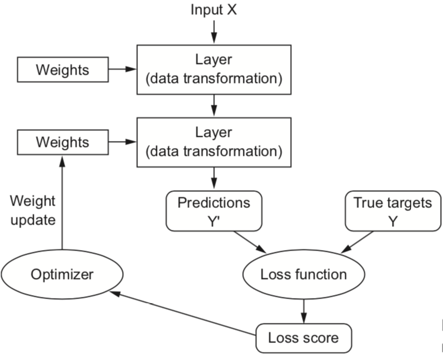
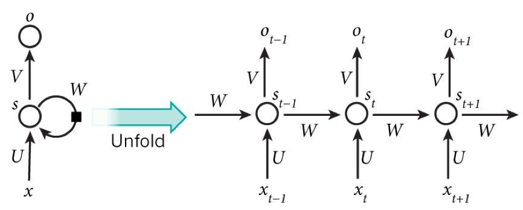
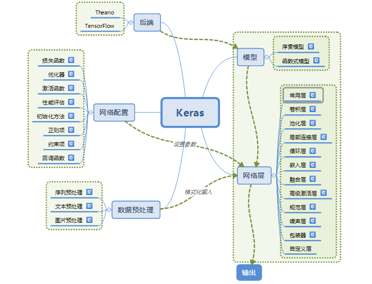
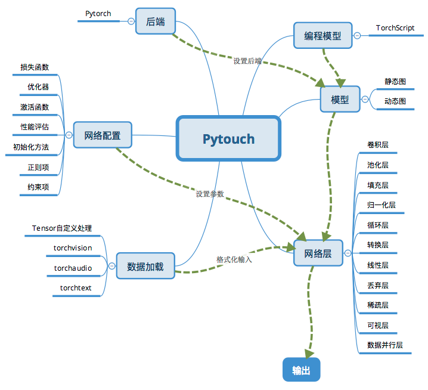
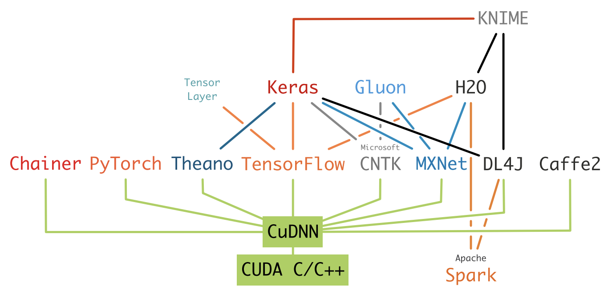

# Deep Learning Basics

[toc]

## 基本模型

​	在介绍所有的库支持，参考[Book PDSH]熟悉Python、Numpy、Pandas、Matplotlib以及sklearn库。

### 经典回归模型[CS229]

假设输入是符合特征为$x \in R^d$的样本，偏差项为$b$，$W$是权重（矩阵）参数，$\hat{y}$是对$y$的预估，经典回归模型可以表达如下：
$$
\hat{y} = Wx + b
$$
有时候bias $b$可以作为$W$的一列进行表示. 也被写作$\theta$, $W$和$b$都是张量。

### 损失函数(cost function)

定义为：
$$
Loss (W, b) = ||\hat{y} - y||_p
$$
p 一般取1、2或者$\infin$. 

学习的目标：
$$
W, b = \mathop{\arg \min}_{W, b} Loss(W, b)
$$

### 深度神经网络

​	包含如下4个主要对象：

* 层，各层链接形成model或者网络
* 输入输出和对应的目标
* 损失函数
* 优化器

基本原理：

1) 正向传播
$$
z = W^{(1)} x \\  
h = \phi(z) \\
o = W^{(2)}h \\
L = Loss(o, y)  \\
s = \frac{\lambda}{2}(||W^{(1)}||_F^2 + ||W^{(2)}||_F^2) \\
J = L + s
$$
目标函数$J(W, b, \lambda)$为带正则项的损失函数,其中  $W^{(1)} \in R^{h \times d}$是隐藏层权重参数, $z \in R^{h}$是隐藏层变量, $o \in R^{q}$是输出层变量，$W^{(2)} \in R^{q \times h}$是输出层权重，假设损失函数为Loss, 样本标签是y. 给定超参为$\lambda$, 计算正则项 $s$，

2)  反向传播

​	相对正向传播计算出代价函数，反向传播目标是通过求梯度，计算(W, b)。首先计算目标函数$J$有关损失项$L$和正则项$s$. 需要借助链式法则。

​	推导过程如下：
$$
\frac{\partial J}{\partial L} = 1, \frac{\partial J}{\partial s} = 1 \\
	\frac{\partial J}{\partial o} = \frac{\partial J}{\partial L} \cdot \frac{\partial L}{\partial o} = \frac{\partial L}{\partial o}\\
	\frac{\partial s}{\partial W^{(1)}} = \lambda W^{(1)},\frac{\partial s}{\partial W^{(2)}} = \lambda W^{(2)} \\
	\frac{\partial J}{\partial W^{(2)}} =\frac{\partial J}{\partial o} \cdot \frac{\partial o}{\partial W^{(2)}}  +  \frac{\partial J}{\partial s} \cdot \frac{\partial s}{\partial W^{(2)}} = \frac{\partial J}{\partial o} h^{T} + \lambda W^{(2)} \\
	
	\frac{\partial J}{\partial h} = \frac{\partial J}{\partial o} \cdot \frac{\partial o}{\partial h} = {W^{(2)}}^T\frac{\partial J}{\partial o}  \\
	\frac{\partial J}{\partial z} = \frac{\partial J}{\partial h} \cdot \frac{\partial h}{\partial z} = \frac{\partial h}{\partial z} \cdot {\phi(z)}^{'} \\
	\frac{\partial J}{\partial W^{(1)}} = \frac{\partial J}{\partial o} \cdot \frac{\partial o}{\partial W^{(1)}}  +  \frac{\partial J}{\partial s} \cdot \frac{\partial s}{\partial W^{(1)}} = \frac{\partial J}{\partial z} x^{T} + \lambda W^{(1)}
$$
​	其中注意$\cdot$表示向量的内积，可能需要对向量调整(专职或者互换输入位置等)。 以上推导过程参考[Book DIDL].

基本过程如下：



<center> 图1： 深度学习计算过程，来自[Book DLP]</center>

### 梯度计算[COCG]

​	


## 主要网络

   CNN在计算机视觉领域应用非常广。借助于卷积层、池化层，借助于填充、步幅以及通道等形式， 参考[CNNs], [Book DIDL]给出了常见的卷积神经网络以及各自之间的关系。

​	RNN对具有序列特性(时间、逻辑等)的数据非常有效，它能挖掘数据中的时序信息以及语义信息，利用了RNN的这种能力，应用在解决语音识别、语言模型、机器翻译以及时序分析等NLP领域。[Book DIDL]有专门的章节介绍各种RNN网络。

​	相对于CNN每层神经元只能向上一层传播，样本的处理在不同时刻是独立的，RNN的输出可以在下一个时间戳上作用在自身上，也就是第k层神经元在t时刻，除了(k-1)层神经元在该时刻的输出外，还包括了其自身在(t-1)时刻的输出。图示如下：



<center>图2： RNN在时间维度上展开，图来自[CNN_RNN_DNN]</center>

​		(t+1)时刻网络的最终结果O(t+1)是该时刻输入和所有历史共同作用的结果, 实现某种记忆能力，达到对时间序列建模的目的。例如典型的n-gram语义理解等。

​	   论文[ZLM]也对多层感知器、CNN、RNN之间做了分析和对比。

## 优化方法

​	优化难点：

 * 非凸优化、平坦局部最小值以及鞍点

 * 梯度消失和爆炸

   由bp算法推动的最后2个步骤得知： $\phi(z)^{'}$ 就是对激活函数求导，如果其求导结果大于1，经过多层计算之后，$\frac{\partial J}{\partial W^{(1)}}$ 就会以指数形式增加，出现梯度爆炸，否则以指数形式递减，形成梯度消失。

* 泛化问题(generalization error):   过拟合问题

### 优化算法

#### 学习率调整（含梯度估计修正）

​	对于正常的梯度下降，设定学习率$\eta \gt 0$,  f为连续可导函数，根据泰勒展开，权重矩阵的训练过程如下：
$$
W = W - \eta \Delta f(x)
$$

1. MBGD: 小批量梯度下降法(mini-batch gradient descent)，从大的训练集里面，分批并且取样进行训练，朝着当前所在位置的坡度最大的方向前进, 在时间步t，
   $$
   g_t = \frac{1}{|B|}  \sum_{i \in B_t} {\Delta f(x)} \\
   W = W - \eta_t g_t
   $$

2. Momentum: 参照小球在碗中滚动的物理规则进行移动,  $\alpha \in (0,1)$, 借助指数加权移动平均使得自变量的更新方向更加一致，从而 可以在开始选择较大的学习率，加速收敛。
   $$
   v_t = \alpha v_{t-1} + \eta_t g_t \\
   W = W - v_t
   $$

3. AdaGrad: Ada来自英文单词Adaptive，即“适当的”的意思；AdaGrad会为参数的每个元素适当地调整更新步伐(学习率)，即学习率衰减，随着学习的进行，使学习率逐渐减小，一开始“多”学，然后逐渐“少”学。$\cdot$表示内积。
   $$
   h_t = h_{t-1} + g_t \cdot g_t  \\
   W = W -  \frac{\eta}{\sqrt{h_t}} g_t
   $$

4. RMSProp:  在AdaGrad的基础上,应用指数加权平均.
   $$
   s_t = \alpha s_{t-1} + (1-\alpha) g_t \cdot g_t \\
   W = W -  \frac{\eta}{\sqrt{h_t}} g_t
   $$

#### 批量大小

​	批大小会印象随机梯度的方差, 跟泛化能力也相关. 批量大小的选择不宜过大或过小，需根据实际需求做出选择，较大的批量可以更准确地估计梯度，而较小的批量可以获得更快的收敛速度.

#### 参数初始化

* 预训/随机/固定值 初始化
* 基于固定方差的初始化： 例如使用高斯分布$N(0, \sigma^2)$.
* 基于方差缩放的参数初始化, 例如Xavier初始化
* 正交初始化： W初始化为正交矩阵， 满足$W^{(l)} (W^{(l)})^T = I$, 使得误差项$\delta^{(l-1)} = ((W^{(l)})^{T}) \delta^{(l)}$满足**范数保持性**，即$\left\|\delta^{(l-1)}\right\|^2 = \left\|\delta^{(l)}\right\|^2 = \left\|((W^{(l)})^{T}) \delta^{(l)}\right\|^2$.

#### 数据预处理[Book NNDL]

* 最小最大值归一化
* 标准化
* 合并

#### 超参数优化[JRYB2011]

​	常见的超参数有:

1. 网络结构,包括神经元之间的连接关系、层数、每层的神经元数量、激活函数的类型. 
2. 批量大小、学习率以及梯度评估方法等
3. 正则化系数等。

常使用随机搜索等方法进行最优组合寻找。

### 网络正则化

#### L1/l2正则

$$
\theta^* = \mathop{\arg \min}_{\theta}\frac{1}{N}\sum_{i}{Loss(y^{(n)}, f(x^{(n)}; \theta))} + \lambda l_p (\theta)
$$

$l_p$为范数。 通过添加范数减少过拟合。

#### 权重衰减

​	 引入衰减系数$\beta$, 在时间步骤t:
$$
\theta_t = (1-\beta)\theta_{t-1} - \alpha g_t
$$

#### 丢弃法

​	是指在训练一个深度神经网络时，我们可以随机丢弃一部分神经元来避免过拟合，每次选择丢弃的神经元是随机的。


## 库和框架

### 深度学习库对比 

#### Keras

​	[Keras](https://keras.io/) 是提供了高度抽象的深度学习API，依赖于TensorFlow进行部署和分布式训练。 提供了丰富的数据预处理和网络配置功能，支持多种框架上运行，实现端到端的深度学习。



<center>图2： Keras模块结构, 图来自[Keras_Intro]</center>	

​	layers的具体介绍参考[layers](https://keras.io/api/layers/).

构建网络步骤：

1. 预处理： `TextVectorization|Normalization `， 调用adapt进行实际的预处理

2. 构建网络层：

   1. 支持的Model

      * Sequential: keras.Sequential(),  a linear stock of layers;

      * Functional: keras.Model(inputs=[input_], outputs=[output]), a graph of layers as nodes.

   2.  Layer: `Input|Dense|Conv2D|MaxPooling|Output|custom`

3. 编译: `compile(optimizer = SGD|RMSprop|Adam..., loss=MeanSquaredError|KLDivergence|CosineSimilarity..., metrics=[AUC...])`

4. 训练: `fit(x, y, batch_size, epochs, validation_data...)`

5. 预测: `predict(x)`


#### PyTorch

​	[PyTorch](https://pytorch.org/)本身算是一个深度学习框架，同时也提供了支持GPU的Tensor计算库和神经网络库, 相对其他深度学习库，支持[**动态计算图** ](https://github.com/pytorch/pytorch#dynamic-neural-networks-tape-based-autograd)。相对静态计算图(computational graph, 节点为张量，边为运算(Function, 卷积、基本运算等))，先搭建图然后运算，动态图是运算与搭建同时进行，更为灵活，但是效率相对较低。

​	

<center>图3： Pytorch模块结构</center>	

​	构建网络步骤：

1. 通过torchvision等进行数据加载；

2. 构建网络， 继承nn.Module，定义layers;

   1.  Layer: `torch.Linear| Conv2D||custom`
   2. 在输入数据集上迭代`torch.functional.forward`;
   3. 定义损失函数和优化器；

3. 训练：

   1. 通过网络处理输入,进行梯度反向传播：

   ```
   net.zero_grad()
   out.backward(torch.randn(1, 10))
   ```

   2. 定义并且计算loss(输出和正确答案的距离）例如选择 `MSELoss`, 然后调用`loss.backward`；

   ```
   output = net(input)
   target = torch.randn(10)  # 本例子中使用模拟数据
   target = target.view(1, -1)  # 使目标值与数据值尺寸一致
   criterion = nn.MSELoss()
   
   loss = criterion(output, target)
   
   net.zero_grad()     # 清零所有参数(parameter）的梯度缓存
   loss.backward()
   ```

   3. 将梯度反向传播给网络的参数,更新网络的权重: 

   ```
   # 创建优化器(optimizer）
   optimizer = optim.SGD(net.parameters(), lr=0.01)
   
   # 在训练的迭代中：
   optimizer.zero_grad()   # 清零梯度缓存
   output = net(input)
   loss = criterion(output, target)
   loss.backward()
   optimizer.step()    # 更新参数
   ```

4. 预测: `net(test_x)`

​	简单总结： Keras和PyTorch的对比参考[Keras_vs_PyTorch].  PyTorch更加灵活，可定制程度高，Debug能力强，同时效率也较高，社区更活跃，适合research，Keras抽象程度高，适合新手入门，对小数据集和快速原型搭建非常适合。

### 深度学习框架对比

​	通过文献[GSMVAPL] 我们可以大概了解目前深度学习库和框架之间的大概关系：



<center> 图4： 流行深度学习框架和库的层次关系 </center>	

​	这里我们只关注框架。

​	[GSMVAPL] P100-101对当前主要机器学习框架和库从licence、开发语言、计算图支持情况、API语言以及流行度、使用场景和项目发起者进行了分析，最流行的框架是TensorFlow，开发语言基本上是c++或者python，只有TensorFlow、PyTorch以及MXNet和Chainer支持动态图， 同时基本所有框架都支持Python API. 最后可以看到大部分框架都是由大厂牵头研发的，人力和财力投入巨大。

​	从性能方面来看，没有一个框架在所有的场景和案例下面都绝对领先于其他框架。从文献[YCWSWQ]可以看到，不同的超参对性能和精确度都有非常大的影响。

## 参考

[Book PDSH] : Python Data Science Handbook

[CS229] :  https://see.stanford.edu/Course/CS229

[JRYB2011] : [Algorithms for Hyper-Parameter Optimization](http://papers.nips.cc/paper/4443-algorithms-for-hyper-parameter-optimization.pdf)

[Book DLP] : Deep Learning with Python

[Book DIDL] : Diving Into Deep Learning

[Book NNDL] : https://nndl.github.io/ , 总结： https://zhuanlan.zhihu.com/p/162943650

[Keras_Intro] : https://blog.csdn.net/zdy0_2004/article/details/74736656

[Keras_vs_PyTorch] : https://deepsense.ai/keras-or-pytorch/

[DL_framework] :  https://www.zhihu.com/question/46587833/answer/104288698

[GSMVAPL] :  [Machine Learning and Deep Learning frameworks and libraries for large-scale data mining: a survey](https://link.springer.com/content/pdf/10.1007/s10462-018-09679-z.pdf), Artificial Intelligence Review(2019), 77-124

[YCWSWQ] :  [A Comparative Measurement Study of Deep Learning as a Service Framework](https://arxiv.org/pdf/1810.12210.pdf)

[CNNs] :  https://zhuanlan.zhihu.com/p/47391705

[CNN_RNN_DNN] https://www.zhihu.com/question/34681168/answer/84061846

[ZLM] : 张荣. et.al《深度学习研究综述》, 2018《信息与控制》385-397.  https://arxiv.org/pdf/1804.01653.pdf

[COCG] http://colah.github.io/posts/2015-08-Backprop/

