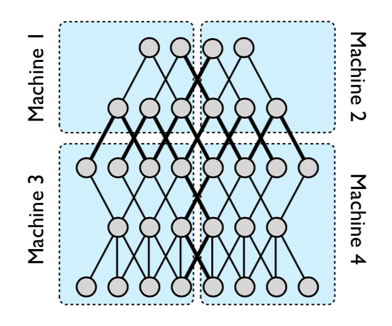
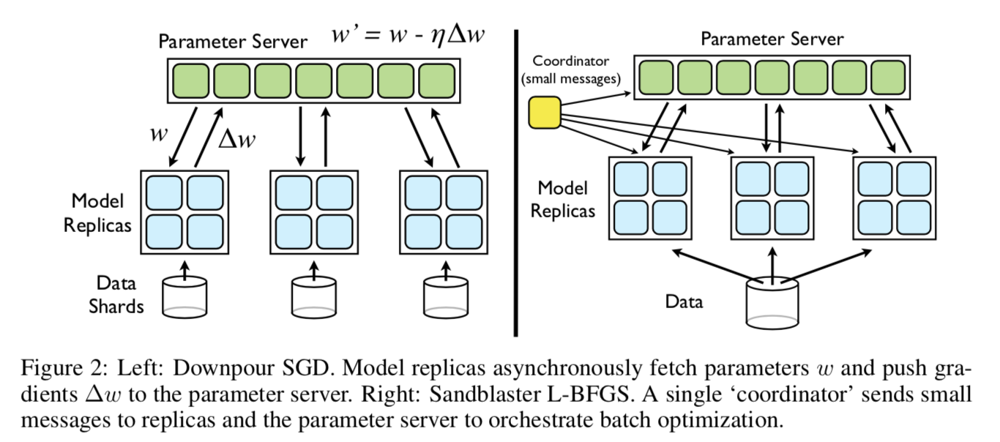
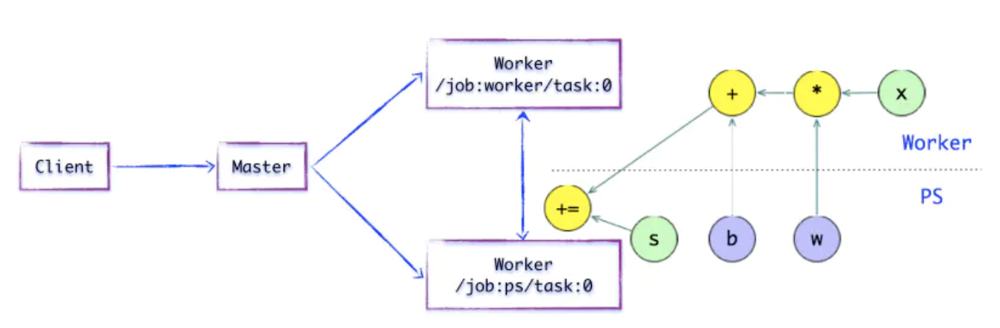
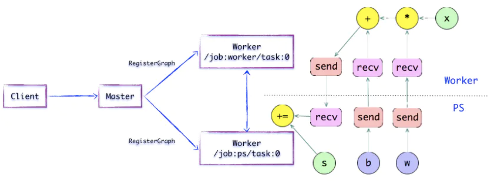
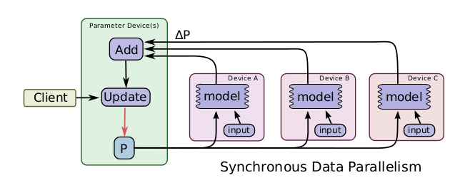
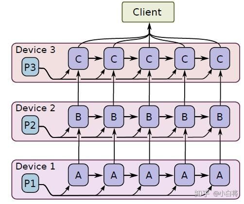

# 分布式深度学习框架

[toc]

​	关于分布式机器学习在《分布式机器学习: 算法，理论与实践》<sup>b0</sup>这本书进行了非常详细的介绍。这本书第三章对整个书籍进行概括，本书主要从

	* 挑战：大规模训练数据的产生，导致计算量、训练数据以及模型规模过大，已有的单机方案以及GPU方案出现性能瓶颈；
 * 分布式机器学习的基本流程
   	* 数据和模型划分： 数据划分解决训练数据过大的问题，模型划分解决模型规模太大的问题； 这种划分势必带来通信量的急剧增加， 类似于“分”
      	* 单机优化： 单机计算本质上是传统的机器学习训练过程；
   	* 通信模块： 通信模块在划分，特别是模型划分的系统中扮演着非常重要的角色。解决多机、多线程之间数据共享的问题。当前主流的通信方式有基于Map/Reduce、参数服务器以及数据流的方式。
   	* 数据和模型聚合模块： 类似于“合”，当前节点收集到其所有依赖节点发送的数据，然后进行本地模型训练；
* 分布式机器学习理论： 从理论部分分析了分布式机器学习算法的收敛速度、加速比和泛化能力。
* 已有分布式机器学习系统的比较

这些方面进行分布机器学习的应用和实践讲解。下面就该书以及其他一些论文的结果，记录学习笔记。

### 主要挑战

#### 大规模训练数据产生

​	计算和存储相辅相成。计算量的增大往往可以通过增加缓存、存储进行缓解，反过来，存储量的增加，则可以借助于分布式、并行计算来并行处理。

​	[GPU]([https://github.com/duanbing/AdvanceCryptoNotes/blob/master/GPU%E5%8A%A0%E9%80%9F-CUDA%E4%BB%8B%E7%BB%8D.md](https://github.com/duanbing/AdvanceCryptoNotes/blob/master/GPU加速-CUDA介绍.md))区别于普通的CPU，具备更强的并行计算能力，适合分支较少的重复性计算。GPU提供了丰富的内存结构配合线程（核心）进行独立计算，因此非常适合深度神经网络的模型训练。AlexNet是最早利用2 GPU进行并行化训练的深度神经网络之一。

​	但是随着数据量的增加，单机上的GPU也无法满足大规模训练的要求，这个时候就需要跨机器间的分布式机器学习框架， 同时在优化方法以及通信方式上都会面临更多的挑战。

#### 优化方法

​	相对于单机优化方法，分布式优化方法在加速比、收敛速度以及泛华性上都有很大的影响。具体来说分布式优化方法涉及到数据/模型划分、节点通信方式以及数据和模型聚合等多个方面。

#### 节点间通信量增加

​	 节点（包括机器内部进程之间以及机器之间）之间的通信量在分布式训练急剧增加，体现在训练数据访问以及梯度数据交换上。同时数据在内存/显存和磁盘/网络之间的拷贝带来的是对设备PCI/E上IO带宽的消耗增大。需要接触已有的DMA技术等技术加速数据的传输；

​	其次，针对不同的优化方法，例如基于数据划分和基于模型划分，通信量相差很大。其次通信过程中，可能拜占庭将军问题，例如个别节点延迟太大(stragglers)、节点异常、梯度结果过时等问题。

#### 异构设备支持

​	异构设备例如GPU、FPGA等充分利用新型的体系结构，减少甚至消除指令流的复杂的控制逻辑（指令存储器、译码器、各种指令的运算器、分支跳转处理逻辑等）从而实现加速，从而实现。 TensorFlow<sup>[5]</sup> 等介绍了针对跨设备在任务编译优化、任务调度以及通信方式做了大量的工作来提升分布式训练效率。

## 分布式训练方法

### 分布式机器学习算法

​	分布式训练最普遍的思路是数据并行和模型并行，因此前提是要有合理的数据和模型拆分方案。

#### 数据和模型拆分

数据的划分分为训练数据的切分以及训练样本特征纬度的划分。

##### 训练数据切分

​	训练数据的切分的前提是保证各节点的数据跟全部训练数据是[独立同分布（IID）]([https://zh.wikipedia.org/wiki/%E7%8B%AC%E7%AB%8B%E5%90%8C%E5%88%86%E5%B8%83](https://zh.wikipedia.org/wiki/独立同分布))的。

1. 随机取样： 有放回抽样
2. 置乱切分： 无放回抽样

##### 训练样本的特征纬度划分

​	针对训练数据纬度较高的情况，并且优化目标线性可分(例如逻辑回归、线性回归、SVM等)，且某个纬度的偏导数可以通过较小的代价得到。

##### 模型划分

​	对于本地无法完全存储的模型文件，需要对模型进行划分。

* 线性模型： 将不同纬度的模型参数划分到不同节点，节点只依赖某些全局变量和对应的纬度数据，独立更新参数, 优化方法如下：
  $$
  \mathop {\min f(w)}_{w \in R^d} := \frac{1}{n}\sum_{n=1}^{n}{l(w; x_i, y_i)} + R(w) \\
  R(w) = \sum_{j=1}^{d}R_j(w_j)
  $$
  ​	R(w)凸且可分。l可以使用平方损失、Logistic损失或者Hinge损失等。

  ​	节点j只需要$(x_j, y_j, w_j)$以及某些全局变量n等即可独立计算梯度，然后在时间步t+1全局更新方式如下：
  $$
  w_{t+1, j} = w _ {t, j} + \Delta{w_j^{'}}
  $$

* 高度非线性神经网络：  

  * 横向按层划分： 例如machine1，2（合并为一个节点，下同） 和machine3， 4之间， 可以借助于流水线<sup>[6]</sup>加速。
  * 纵向跨层划分： 例如machine1，3 和machine 2，4之间
  * 模型随机划分： 骨架网络 + 随机的非骨架网络的神经元参数

  

  <center>图1： An example of model parallelism in DistBelief <sup>[1]</sup></center>

  ​	这里提到骨架网络，一个更小的神经网络，但是因为神经网络的冗余性，这个更小的神经网络能够达到类似的拟合效果。那么每个节点都存储骨架网络。 骨架网络的选择可以参考[7]，  将连边的重要性之定义为边权重加上连边梯度的绝对值。

#### 单机优化

各个算法的收敛速度参考书籍[b0] 。

##### 随机梯度下降

时间步t， 对于随机选择的样本$i_t \in {1...n}$ , 参数更新如下：
$$
w_{t+1} = w_t - \eta_{t}\Delta{f_{i_t}(w_t)}
$$
​	小批量随机梯度下降跟SGD的区别在于$S_t$是一个小批量样本集合，
$$
\Delta{f_{S_t}(w_t)} = \frac{1}{|S_t|}\sum_{i\in S_t}\Delta f_i(w_t)    \\
w_{t+1} = w_t - \eta_{t}\Delta{f_{S_t}(w_t)}
$$

##### 随机坐标下降法

​	样本随机抽样+模型纬度随机抽样。 选择随机纬度$j_t \in {1...d}$, 
$$
w_{t+1, j_t} = w_{t,j_t} - \eta_{t}\Delta_{j_t}{f(w_t)}
$$
​	$\Delta_{j_t}{f(w_t)}$是损失函数对模型$w_i$中的第$j_t$个纬度的偏导数。

##### 随机拟牛顿法

​	牛顿法是将目标函数展开为二阶泰勒展开式，最小化这个展开式作为目标函数。构造一个跟Hessian矩阵相差不远的正定矩阵，通过拟牛顿法可以迭代更新该矩阵的逆矩阵。

​	在牛顿法中$H_t$的计算比较复杂，所以构造拟牛顿条件(割线方程，Secant equation)如下：
$$
\Delta f(w) = \Delta f(w_t) + B_t(w - w_t) \\
f(w) = f(w_{t}) + B_t(w - w_t)  \\
Def:\ \ \delta _t = w_{t+1} - w_{t}, \delta _t^{'} = \Delta f(w) - \Delta f(w_t) \\

S.T.\ \  B_t^{-1} \delta_t^{'} \approx  \delta _t
$$
​	根据[Wolfe conditions](https://en.wikipedia.org/wiki/Wolfe_conditions)，可以证明$B_t$相对$\delta_t$是正定的。

​	 构造满足上面条件的权重更新[方式](https://www.cnblogs.com/liuwu265/p/4714396.html)有：

* BFGS算法
* DFP算法

##### 随机对偶坐标上升法

​	利用对偶问题（对偶可分），假设损失函数是凸函数且L-Lipschitz连续。其效率能够达到次线性收敛效率。

##### 非凸随机优化算法

​	非凸优化算法可能出现鞍点以及局部最小值问题，采用Ada系列算法中，Adam综合考虑了包括冲量算法、AdaGrad以及RMSProp等算法中所有的因素：

	1. 考虑历史梯度累计计算，
 	2. 对步长利用累加的梯度平方值进行修正
 	3. 信息累加按照指数形式衰减

因此效果最好。

#### 数据和模型聚合

##### 全部加和聚合

​	模型平均(MA)就是简单的将所有节点的模型的参数进行平均，得到新的模型。BMUF在MA的基础上加入了冲量，也就是在参数平均值上加入冲量进行调整。还有SSGD、EASGD等基于MA的方法。ADMM 在文献[b0], [10]给出了详细的介绍，区别MA是在优化问题里面引入了拉格朗日正则项，使得不容易出现过拟合，但是效率不如MA。

##### 部分模型加和

​	在同步梯度下降法的训练过程中，利用备份几点，防止个别慢节点拖慢整体训练效率。异步ADMM采用了类似备份节点的思路进行全局平均值$z$的聚合和分发，同时增加节点的最大更新延迟。去中心化的分布式机器学习算法(D-PSGD)则是将本地的梯度信息， 结合邻接点的最新模型乘以2个节点之间的关联度信息，来更新本地参数。

##### 基于模型集成的聚合方法

​	模型集成引入“模型压缩”环节，对样本进行再标注，解决非凸场景下的优化问题。


#### 分布式机器学习算法

​	分布式机器学习算法分为同步和异步。同步算法包括经典的SGD、MA、ADMM、EASGD等。异步包括异步SGD、Hogwild!等。

##### 弹性平均SGD算法EASGD

​	弹性平均SGD算法相对ADMM是不强制要求各个节点集成全局模型$z$,  也就是在优化函数中，EASGD不需要各个节点继承全局模型$z$，但是在优化方法加入全局模型（非全局模型在当前节点的反馈），保证局部模型跟全局模型的偏离不会过大。

##### ASGD

​	异步SGD非常简单，但是面临个别worker更新延迟过大导致梯度和模型失配的问题。

##### Hogwild!/Cyclades算法

​	Hogwild！的假设是在稀疏模型下，权重更新冲突的情况极少。Cyclades算法试图解决冲突问题，将样本进行分组，分组的要求是样本对应的参数尽量不重叠，然后将不同的数据送到不同的核上，完成异步无所的多线程更新。

### 节点间通信

#### 通信内容

* 参数/参数更新
* 计算中间结果

#### 通信拓扑

​	通信拓扑是对分布式计算集群中节点连接和通信的形式。

##### 基于迭代式MapReduce/AllReduce拓扑

​	典型的实现有Spark MLLib等IMR框架。MapReduce过程在Map阶段进行数据分发、并行处理，在Reduce阶段进行实现数据的全局同步和规约。AllReduce在文献[9]，[b0]给出了比较详细的介绍，AllReduce定义了一套消息通信接口(MPI),  具体的通信拓扑可以实现为星型、树形、蝶形或者ReduceScatter+AllGather的形式。

​	文献[9]特别给出了多种基于ReduceScatter+AllGather算法的优化。 例如：

	* Binary Blocks Algorithm: 引入将机器分成多种blocks，每个blocks里面机器数是2的幂次方，然后按照各个block中机器数，从少到大排成行，从最小的开始，进行第一次Reduce，然后将Reduce结果发送给更大的block，进行第二次Reduce，直到将结果发送给机器数最大的Block。 然后开始从大到小，进行Gather。 这种算法最大程度的对计算力在不同的服务器之间进行均衡分配。

​	这种拓扑模式只支持同步通信，并且只支持数据划分，不能支持模型划分， 对大的模型不适合，同时慢节点很容易拖慢整个训练。

##### 基于参数服务器的通信拓扑

​	Google DistBelief以及微软DMTK采用的就是这种拓扑结构。例如DistBelief的2种拓扑结构如下：



	<center> 图2： 参数服务器介绍， 来自文献[2]</center>

​		这种结构工作节点之间运行逻辑一致，但是相互不通信，只与参数服务器通信，通信方式可以是Push/Pull，步调可灵活设置。参数服务器依赖于异步参数更新机制，例如AdamGrad/冲量加速算法等。

##### 基于数据流的通信拓扑

​	计算任务很容易被描述为一个有向无环的数据流图，数据处理或者计算是节点，每条边代表数据以及流动方向，当2个节点位于2台不同的机器时候，他们之间会发生通信。TensorFlow就是使用的这种结构，示意如下：



<center> 图3： TensorFlow单机运算，图来自[b1] </center>





<center>图4：  Tensorflow多机/设备运算，图来自[b1]	</center>

​	可以看到当PS和Worker分布不同节点的时候，就需要通过跨进程的传输方式进行参数或者中间加过的传递，对应在数据流通的操作就是将涉及到的边进行分裂，形成不同的子图片段，然后交给不同的Worker进行对应的计算。这种数据流模式非常符合适合参考编译器的实现进行各种CFG优化。例如公共表达式消除等。

### Tensorflow分布式训练[5]

#### 数据并行

​	分同步和异步数据并行。

<center class="half">    
  
   
</center>

​	所谓同步指的是所有的设备都是采用相同的模型参数来训练，等待所有设备的mini-batch训练完成后，收集它们的梯度然后取均值，然后执行模型的一次参数更新。 异步则是各自更新梯度。

#### 模型并行



​		将模型的不同部分分布到多个设备进行训练，深度学习模型一般包含很多层，如果要采用模型并行策略，一般需要将不同的层运行在不同的设备上，但是实际上层与层之间的运行是存在约束的：前向运算时，后面的层需要等待前面层的输出作为输入，而在反向传播时，前面的层又要受限于后面层的计算结果。

#### Tensorflow分布式训练

```
cluster = tf.train.ClusterSpec({
    "worker": [
        "worker0.example.com:2222",
        "worker1.example.com:2222",
        "worker2.example.com:2222"
    ],
    "ps": [
        "ps0.example.com:2222",
        "ps1.example.com:2222"
    ]
})
```

​	上图可以看到，cluster是job的集合。job分为两类 worker和ps，也可以是其他的，通过name区分。每个job分为多个task，通过index区分。

​	上图的spec最终的5个task如下：

```
/job:worker/task:0
/job:worker/task:1
/job:worker/task:2
/job:ps/task:0
/job:ps/task:1
```

​	创建好cluster，需要创建各个task的server，使用`tf.train.Server`函数，比如创建第一个worker的server：

```
server = tf.train.Server(cluster, job_name="worker", task_index=0)
```

在创建sever时必须要传入cluster，这样每个server才可以知道自己所在的cluster包含哪些hosts，然后server与server之间才可以通信。sever的创建需要在自己所在host上，一旦所有的server在各自的host上创建好了，整个集群搭建完毕。

​	构建图的时候，通过`tf.device`指定调用到具体的server。 如下：

```
with tf.device("/job:ps/task:0"):
  weights_1 = tf.Variable(...)
  biases_1 = tf.Variable(...)

with tf.device("/job:ps/task:1"):
  weights_2 = tf.Variable(...)
  biases_2 = tf.Variable(...)

with tf.device("/job:worker/task:7"):
  input, labels = ...
  layer_1 = tf.nn.relu(tf.matmul(input, weights_1) + biases_1)
  logits = tf.nn.relu(tf.matmul(layer_1, weights_2) + biases_2)
  # ...
  train_op = ...
```

​	构建了Graph后，我们需要创建Session来执行计算图:

```
with tf.Session("grpc://worker7.example.com:2222") as sess:
  for _ in range(10000):
    sess.run(train_op)
```

​	注意由于是分布式系统，需要指定Session的target参数，或者采用grpc+主机地址，或者直接利用sever.target，两个是完全一样的。

#### Replicated training

1. **In-graph replication**：只构建一个client，这个client构建一个Graph，Graph中包含一套模型参数，放置在ps上，同时Graph中包含模型计算部分的多个副本，每个副本都放置在一个worker上，这样多个worker可以同时训练复制的模型。TensorFlow教程中的使用多个GPUs训练[cifar10分类模型](https://www.tensorflow.org/tutorials/deep_cnn#training_a_model_using_multiple_gpu_cards)就属于这个类型，每个GPUs上的计算子图是相同的，但是属于同一个Graph。这种方法很少使用，因为一旦client挂了，整个系统就全崩溃了，容错能力差。

2. **Between-graph replication**：每个worker都创建一个client，这个client一般还与task的主程序在同一进程中。各个client构建相同的Graph，但是参数还是放置在ps上。这种方式就比较好，一个worker的client挂掉了，系统还可以继续跑。

3. **Asynchronous training**：异步方式训练，各个worker自己干自己的，不需要与其它worker来协调，前面也已经详细介绍了异步训练，上面两种方式都可以采用异步训练。

4. **Synchronous training**：同步训练，各个worker要统一步伐，计算出的梯度要先聚合才可以执行一次模型更新，对于In-graph replication方法，由于各个worker的计算子图属于同一个Graph，很容易实现同步训练。但是对于Between-graph replication方式，各个worker都有自己的client，这就需要系统上的设计了，TensorFlow提供了[tf.train.SyncReplicasOptimizer](https://www.tensorflow.org/api_docs/python/tf/train/SyncReplicasOptimizer)来实现Between-graph replication的同步训练。

   ​	使用tf.train.replica_device_setter可以自动把Graph中的Variables放到ps上，而同时将Graph的计算部分放置在当前worker上。由于ps往往不止一个，这个函数在为各个Variable分配ps时默认采用简单的round-robin方式，就是按次序将参数挨个放到各个ps上，但这个方式可能不能使ps负载均衡，如果需要更加合理，可以采用[tf.contrib.training.GreedyLoadBalancingStrategy](https://www.tensorflow.org/api_docs/python/tf/compat/v1/train/replica_device_setter)策略。

   ​	采用Between-graph replication方式的另外一个问题，由于各个worker都独立拥有自己的client，但是对于一些公共操作比如模型参数初始化与checkpoint文件保存等，如果每个client都独立进行这些操作，显然是对资源的浪费。为了解决这个问题，一般会指定一个worker为chief worker，它将作为各个worker的管家，协调它们之间的训练，并且完成模型初始化和模型保存和恢复等公共操作。

### 分布式计算理论

​	TBD。

## 参考

[b0] 《分布式机器学习: 算法，理论与实践》 刘铁岩...

[b1] [《TensorFlow内核剖析》](https://github.com/horance-liu/tensorflow-internals), [PDF](https://raw.github.com/horance-liu/tensorflow-internals/master/tensorflow-internals.pdf), 刘光聪...

[1] Jeffrey Dean, et.al.  Large Scale Distributed Deep Networks, 2012

[2] Hogwild!: A Lock-Free Approach to Parallelizing Stochastic Gradient Descent

[3] Wei Zhang, et.al.  Staleness-aware Async-SGD for Distributed Deep Learning

[4] L. Deng, et.al. Scalable stacking and learning for building deep architecure, In ICASSP, 2012

[5] Mart ́ın, et.al. TensorFlow: Large-Scale Machine Learning on Heterogeneous Distributed Systems, 2015

[6] Biye Jiang, et.al XDL: An Industrial Deep Learning Framework for High-dimensional Sparse Data, 2019

[7] Song Han, et.al Learning both Weights and Connections for Efficient Neural Networks, 2015

[8] [https://zh.wikipedia.org/wiki/%E6%93%AC%E7%89%9B%E9%A0%93%E6%B3%95](https://zh.wikipedia.org/wiki/擬牛頓法)

[9] Karanbir Chahal, et.al A Hitchhiker's Guide On Distributed Training of Deep Neural Networks, 2018

[10] ADMM推导过程： https://www.zhihu.com/question/309568920/answer/580226096


 


