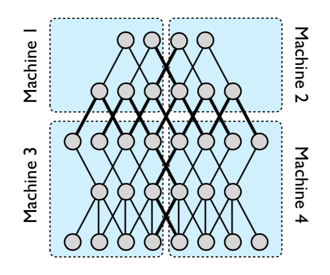

# 分布式深度学习框架

[toc]

​	关于分布式机器学习在《分布式机器学习: 算法，理论与实践》b0这本书进行了非常详细的介绍。这本书第三章对整个书籍进行概括，本书主要从

	* 挑战：大规模训练数据的产生，导致计算量、训练数据以及模型规模过大，已有的单机方案以及GPU方案出现性能瓶颈；
 * 分布式机器学习的基本流程
   	* 数据和模型划分： 数据划分解决训练数据过大的问题，模型划分解决模型规模太大的问题； 这种划分势必带来通信量的急剧增加， 类似于“分”
   	* 单机优化： 单机计算本质上是传统的机器学习训练过程；
   	* 通信模块： 通信模块在划分，特别是模型划分的系统中扮演着非常重要的角色。解决多机、多线程之间数据共享的问题。当前主流的通信方式有基于Map/Reduce、参数服务器以及数据流的方式。
   	* 数据和模型聚合模块： 类似于“合”，当前节点收集到其所有依赖节点发送的数据，然后进行本地模型训练；
* 分布式机器学习理论： 从理论部分分析了分布式机器学习算法的收敛速度、加速比和泛化能力。
* 已有分布式机器学习系统的比较

这些方面进行分布机器学习的应用和实践讲解。下面就该书以及其他一些论文的结果，记录学习笔记。

### 主要挑战

#### 大规模训练数据产生

​	计算和存储相辅相成。计算量的增大往往可以通过增加缓存、存储进行缓解，反过来，存储量的增加，则可以借助于分布式、并行计算来并行处理。

​	[GPU]([https://github.com/duanbing/AdvanceCryptoNotes/blob/master/GPU%E5%8A%A0%E9%80%9F-CUDA%E4%BB%8B%E7%BB%8D.md](https://github.com/duanbing/AdvanceCryptoNotes/blob/master/GPU加速-CUDA介绍.md))区别于普通的CPU，具备更强的并行计算能力，适合分支较少的重复性计算。GPU提供了丰富的内存结构配合线程（核心）进行独立计算，因此非常适合深度神经网络的模型训练。AlexNet是最早利用2 GPU进行并行化训练的深度神经网络之一。

​	但是随着数据量的增加，单机上的GPU也无法满足大规模训练的要求，这个时候就需要跨机器间的分布式机器学习框架， 同时在优化方法以及通信方式上都会面临更多的挑战。

#### 优化方法

​	相对于单机优化方法，分布式优化方法在加速比、收敛速度以及泛华性上都有很大的影响。具体来说分布式优化方法涉及到数据/模型划分、节点通信方式以及数据和模型聚合等多个方面。

#### 节点间通信量增加

​	 节点（包括机器内部进程之间以及机器之间）之间的通信量在分布式训练急剧增加，体现在训练数据访问以及梯度数据交换上。同时数据在内存/显存和磁盘/网络之间的拷贝带来的是对设备PCI/E上IO带宽的消耗增大。需要接触已有的DMA技术等技术加速数据的传输；

​	其次，针对不同的优化方法，例如基于数据划分和基于模型划分，通信量相差很大。其次通信过程中，可能拜占庭将军问题，例如个别节点延迟太大(stragglers)、节点异常、梯度结果过时等问题。

#### 异构设备支持

​	异构设备例如GPU、FPGA等充分利用新型的体系结构，减少甚至消除指令流的复杂的控制逻辑（指令存储器、译码器、各种指令的运算器、分支跳转处理逻辑等）从而实现加速，从而实现。 TensorFlow[5] 等介绍了针对跨设备在任务编译优化、任务调度以及通信方式做了大量的工作来提升分布式训练效率。

## 分布式训练方法

### 优化方法

​	分布式训练最普遍的思路是数据并行和模型并行，因此前提是要有合理的数据和模型拆分方案。

#### 数据和模型拆分

数据的划分分为训练数据的切分以及训练样本特征纬度的划分。

##### 训练数据切分

​	训练数据的切分的前提是保证各节点的数据跟全部训练数据是[独立同分布（IID）]([https://zh.wikipedia.org/wiki/%E7%8B%AC%E7%AB%8B%E5%90%8C%E5%88%86%E5%B8%83](https://zh.wikipedia.org/wiki/独立同分布))的。

1. 随机取样： 有放回抽样
2. 置乱切分： 无放回抽样

##### 训练样本的特征纬度划分

​	针对训练数据纬度较高的情况，并且优化目标线性可分(例如逻辑回归、线性回归、SVM等)，且某个纬度的偏导数可以通过较小的代价得到。

##### 模型划分

​	对于本地无法完全存储的模型文件，需要对模型进行划分。

* 线性模型： 将不同纬度的模型参数划分到不同节点，节点只依赖某些全局变量和对应的纬度数据，独立更新参数, 优化方法如下：
  $$
  \mathop {\min f(w)}_{w \in R^d} := \frac{1}{n}\sum_{n=1}^{n}{l(w; x_i, y_i)} + R(w) \\
  R(w) = \sum_{j=1}^{d}R_j(w_j)
  $$
  ​	R(w)凸且可分。l可以使用平方损失、Logistic损失或者Hinge损失等。

  ​	节点j只需要$(x_j, y_j, w_j)$以及某些全局变量n等即可独立计算梯度，然后在时间步t+1全局更新方式如下：
  $$
  w_{t+1, j} = w _ {t, j} + \Delta{w_j^{'}}
  $$

* 高度非线性神经网络：  

  * 横向按层划分： 例如machine1，2（合并为一个节点，下同） 和machine3， 4之间， 可以借助于流水线[6]加速。
  * 纵向跨层划分： 例如machine1，3 和machine 2，4之间
  * 模型随机划分： 骨架网络 + 随机的非骨架网络的神经元参数

  

  
图1： An example of model parallelism in DistBelief [1]

  ​	这里提到骨架网络，一个更小的神经网络，但是因为神经网络的冗余性，这个更小的神经网络能够达到类似的拟合效果。那么每个节点都存储骨架网络。 骨架网络的选择可以参考[7]，  将连边的重要性之定义为边权重加上连边梯度的绝对值。

#### 单机优化

各个算法的收敛速度参考书籍[b0] 。

##### 随机梯度下降

时间步t， 对于随机选择的样本$i_t \in {1...n}$ , 参数更新如下：
$$
w_{t+1} = w_t - \eta_{t}\Delta{f_{i_t}(w_t)}
$$
​	小批量随机梯度下降跟SGD的区别在于$S_t$是一个小批量样本集合，
$$
\Delta{f_{S_t}(w_t)} = \frac{1}{|S_t|}\sum_{i\in S_t}\Delta f_i(w_t)    \\
w_{t+1} = w_t - \eta_{t}\Delta{f_{S_t}(w_t)}
$$

##### 随机坐标下降法

​	样本随机抽样+模型纬度随机抽样。 选择随机纬度$j_t \in {1...d}$, 
$$
w_{t+1, j_t} = w_{t,j_t} - \eta_{t}\Delta_{j_t}{f(w_t)}
$$
​	$\Delta_{j_t}{f(w_t)}$是损失函数对模型$w_i$中的第$j_t$个纬度的偏导数。

##### 随机拟牛顿法

​	牛顿法是将目标函数展开为二阶泰勒展开式，最小化这个展开式作为目标函数。构造一个跟Hessian矩阵相差不远的正定矩阵，通过拟牛顿法可以迭代更新该矩阵的逆矩阵。

​	在牛顿法中$H_t$的计算比较复杂，所以构造拟牛顿条件(割线方程，Secant equation)如下：
$$
\Delta f(w) = \Delta f(w_t) + B_t(w - w_t) \\
f(w) = f(w_{t}) + B_t(w - w_t)  \\
Def:\ \ \delta _t = w_{t+1} - w_{t}, \delta _t^{'} = \Delta f(w) - \Delta f(w_t) \\

S.T.\ \  B_t^{-1} \delta_t^{'} \approx  \delta _t
$$
​	根据[Wolfe conditions](https://en.wikipedia.org/wiki/Wolfe_conditions)，可以证明$B_t$相对$\delta_t$是正定的。

​	 构造满足上面条件的权重更新[方式](https://www.cnblogs.com/liuwu265/p/4714396.html)有：

* BFGS算法
* DFP算法

##### 随机对偶坐标上升法

​	利用对偶问题（对偶可分），假设损失函数是凸函数且L-Lipschitz连续。其效率能够达到次线性收敛效率。

##### 非凸随机优化算法

​	非凸优化算法可能出现鞍点以及局部最小值问题，采用Ada系列算法中，Adam综合考虑了包括冲量算法、AdaGrad以及RMSProp等算法中所有的因素：

	1. 考虑历史梯度累计计算，
 	2. 对步长利用累加的梯度平方值进行修正
 	3. 信息累加按照指数形式衰减

因此效果最好。

#### 数据和模型聚合

##### 加和平均

##### 

#### 当前一些主流的训练方式

当前主要的机器学习框架中结合如下多种并行方式进行计算

 	1. GPU并行模式
      	1. AlexNET等基于双GPU的并行训练；
 	2. 多节点分批并行执行，取梯度平均值[4][5]；
 	3. 图计算模式，结合数据流分析，分析依赖子图，然后将子图分发到多节点执行[5]；
 	4. Pipeline[5][6],将训练过程分解为不同的stages，然后利用线程池等技术并行执行训练，可以有效的解决资源瓶颈的问题，
 	5. 平衡内存和IO使用，将稀疏网络转换为稠密网络[6]；

### 节点间通信

#### 通信内容

* 参数/参数更新
* 计算中间结果

#### 通信拓扑

​	通信拓扑是对分布式计算集群中节点连接和通信的形式。

##### 基于迭代式MapReduce/AllReduce拓扑

​	典型的实现有Spark MLLib等IMR框架。MapReduce过程在Map阶段进行数据分发、并行处理，在Reduce阶段进行实现数据的全局同步和规约。AllReduce在文献[9]，[b0]给出了比较详细的介绍，AllReduce定义了一套消息通信接口(MPI),  具体的通信拓扑可以实现为星型、树形、蝶形或者ReduceScatter+AllGather的形式。

​	文献[9]特别给出了多种基于ReduceScatter+AllGather的优化算法。

​	这种拓扑模式只支持同步通信。

##### 基于参数服务器的通信拓扑

##### 基于数据流拓扑

##### 主要实现

###### DistBelief/Tensorflow[1][5]

​	[DistBelief](https://en.wikipedia.org/wiki/TensorFlow#DistBelief)是TensorFlow的前身，通过并行、同步以及通信的优化，支持深度神经学习可以在节点内和节点间进行并行训练，支持超大规模参数的模型的训练。 实验显示，借助于自适应学习率调整和足够的计算资源，其在非凸问题上也有很好的表现。

​	DistBelief提出了2种并行化的思路。

*  Downpour SGD

  DSGD是一种[在线算法](https://en.wikipedia.org/wiki/Online_algorithm),  首先将数据分片，分配到各个机器，然后每个机器在本地借助AdaGrad等自适应学习率优化方法进行模型训练，根据实现选定的nFetch和nPush参数，定期的拉取和推送本地更新的参数。  这种方式一方面提高了标准同步SGD算法的鲁棒性（节点失效导致更新夯住），更好的随机性。当模型较大的嘶吼，加速会随着机器数量的增加而提高，最好的情况通过128机器实现12倍的加速。在解决非凸问题上虽然理论支撑不足，但是实际效果还不错。

* Sandblaster L-BFGS

  Sandblaster是一种批处理算法，

###### Hogwild!

​	Hogwild!提供了一种”无锁方式并行运行SGD“。

## 参考

[b0] 《分布式机器学习: 算法，理论与实践》 刘铁岩...

[1] Jeffrey Dean, et.al.  Large Scale Distributed Deep Networks, 2012

[2] Hogwild!: A Lock-Free Approach to Parallelizing Stochastic Gradient Descent

[3] Wei Zhang, et.al.  Staleness-aware Async-SGD for Distributed Deep Learning

[4] L. Deng, et.al. Scalable stacking and learning for building deep architecure, In ICASSP, 2012

[5] Mart ́ın, et.al. TensorFlow: Large-Scale Machine Learning on Heterogeneous Distributed Systems, 2015

[6] Biye Jiang, et.al XDL: An Industrial Deep Learning Framework for High-dimensional Sparse Data, 2019

[7] Song Han, et.al Learning both Weights and Connections for Efficient Neural Networks, 2015

[8] [https://zh.wikipedia.org/wiki/%E6%93%AC%E7%89%9B%E9%A0%93%E6%B3%95](https://zh.wikipedia.org/wiki/擬牛頓法)

[9] Karanbir Chahal, et.al A Hitchhiker's Guide On Distributed Training of Deep Neural Networks, 2018

 

