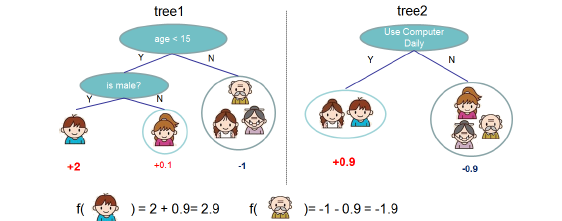
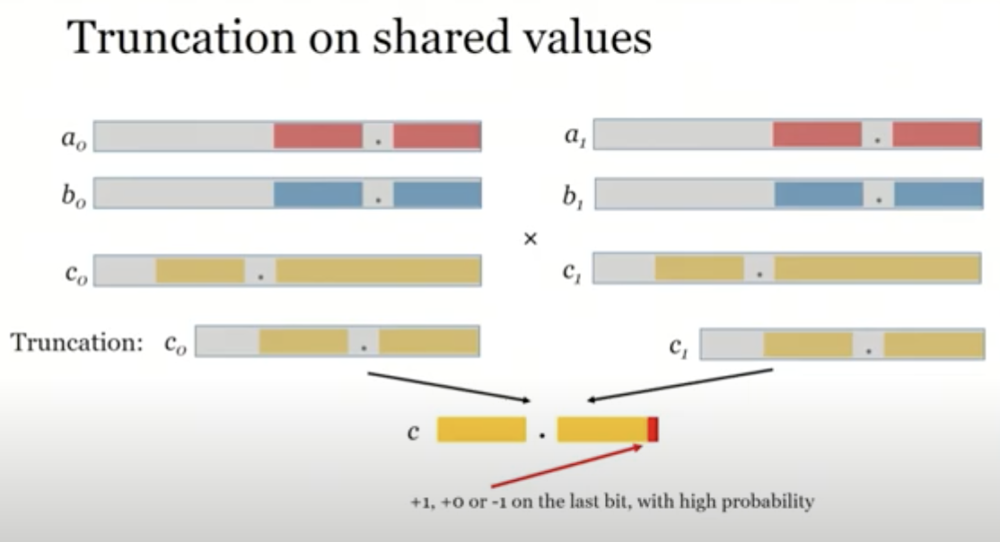

# 联邦学习

Bing Duan, 2020.9

[toc]

## 联邦学习简介

```
Federated learning is a machine learning setting where multiple entities (clients) collaborate in solving a machine learning problem, under the coordination of a central server or service provider. Each client’s raw data is stored locally and not exchanged or transferred; instead, Focused updates are updates narrowly scoped to contain the minimum information necessary for the specific learning task at hand; aggregation is performed as earlier as possible in the service of data minimization.
```

以上定义来自参考[1].  可以总结为联邦学习本质上是一种分布式机器学习，目标是在保证各方数据隐私的情况下，完成联合建模的一种分布式机器学习方案。

​	参考文献[1],[6]，形式化定义如下：

​	定义N个数据提供方${F_1,...,F_n}$以及他们对应的数据${D_1, ..., D_n}, D = \bigcup\limits_{i=1}^nD_i$,  假设在数据$D$下真实训练的模型结果为$M_{sum}$, 准确值为$V_{sum}$, 基于联邦学习模型计算的模型结果为$M_{fed}$,准确值为$V_{fed}$,要求对于足够小的非负数$\delta$, 满足 :
$$
|V_{sum} - V_{fed}| < delta
$$
将其称之为$\delta-accuracy$损失。

### 分类

​	针对参与方的**数据分布**的不同，文献[2]将联邦学习学习常分为3类， 假设2方计算 ， X表示特征，Y为标签，I为样例的ID。

* 横向联邦学习:   两个数据集的用户特征重叠较多，而用户(也可以称作样本或者ID空间等)重叠较少的情况下， 对数据按照用户纬度切分；例如两方均有用户的所有属性数据，但是所在的范围不一样。

  形式定义如下：
  $$
  X_i = X_j, Y_i = Y_j, I_i \neq I_j, \forall D_i, D_j, i \neq j
  $$
  

  

  <center> 图1： Architecture for a horizontal federated learning system 图来自[6]</center>

  ​	其步骤如下：

  	1. 参与方在本地进行梯度计算，然后将梯度进行加密、添加差分噪音或者基于秘钥共享机制加密本地梯度，然后将加密梯度传递给中心化服务器A；
   	2. 服务端进行多方安全计算，计算梯度聚合；
   	3. 将聚合计算的梯度结果返回给不同的参与方；
   	4. 参与方解密梯度结果，并且更新本地梯度；

    例如对于LR，文献[5]、[6]采用模型平均聚合算法，在协调服务器上进行将参数结果进行平均或者不采用协调服务器，直接利用半同态[7]进行双方参数交换。

  ​	横向联邦建立在半诚实模型的基础上，对于权重信息可能导致信息泄露，可以引入差分隐私[8]等技术进一步将结果进行模糊处理。

* 纵向联邦学习： 两个数据集的用户重叠较多，而用户特征重叠较少的情况下，对数据按照特征纬度切分。纵向联邦核心解决的是**“模型并行”场景下的本地数据隐私保护**。

  形式定义如下：
  $$
  X_i \neq X_j, Y_i \neq Y_j, I_i = I_j, \forall D_i, D_j, i \neq j
  $$
  典型的架构图下。

  

  <center> 图1：  Architecture for a vertical federated learning system 图来自[6]</center>

  ​	训练的基本步骤如下：	 

  1. 样本对齐。这一部分借助于PSI[9,10,11]（隐私保护求交）计算各方的用户ID交集；

  2. 加密模型训练， 使用交集用户进行训练：

     2.1. 由第三方C常见一堆公私钥，并向A和B发送公钥，用来加密需要传输的数据；

     2.2. A和B分别计算和自己相关的特征中间结果，并加密交互，用来求得各自梯度和损失；

     2.3. A和B分别计算各自加密后的梯度并添加掩码(additional mask)发送给C，同时B计算加密后的损失发送给C；

     2.4. C解密梯度和损失后回传给A和B，A、B去除掩码并更新模型。

  ​	例如只有一方有Y，另外一方有X， 要在不暴露的情况下计算权重矩阵W。常借助于同态、多方安全计算等，实现联合梯度运算, 文献[5] P26-37以及文献[6]给出了LR算法的具体实现, 包括依赖第三方和不依赖第三方的方案。

* 联邦迁移学习： 在两个数据集的用户与用户特征重叠都较少的情况下，我们不对数据进行切分，而利用迁移学习[3],[4]来克服数据或标签不足的情况。

  形式定义如下：
  $$
  X_i \neq X_j, Y_i \neq Y_j, I_i \neq I_j, \forall D_i, D_j, i \neq j
  $$
  迁移学习的核心是，找到源领域和目标领域之间的相似性。联邦迁移学习的步骤与纵向联邦学习相似，只是中间传递结果不同（实际上每个模型的中间传递结果都不同）。文献[12]给出了一种具体的实现思路。 

​	由上面的介绍可以看到，传统的分布式机器学习跟水平联邦学习比较类似。

### 安全分析

#### 攻击模型

* 半诚实模型 (honest but curious adversary, HbC)。协议的各参与方遵守协议的执行过程，但可以在协议执行 过程中，根据输入和协议的输出信息推断其他参与者的信息。
* 恶意模型（malicious adversary, Mal）。参与者不遵守协议的执行过程，可能拒绝参与协议、修改隐私的输入集合信息、提前终止协议的执行等，因此需要使用更多的密码协议或技术（位比特承诺协议、零知识证明等）来保证计算结果的正确性。
* 隐蔽敌手模型（covert adversary）。是一种安全性介于半诚实模型和恶意模型之间的更符合真实场景的模型，由 于担心恶意行为被协议检测出来并受到惩罚，隐蔽敌手使其恶意行为混淆在正常行为中，只能以一定的概率被检测到。	

​	考虑到效率，联邦学习基本上建立在半诚实模型的基础上。可以借助于承诺以及ZKP等技术实现在恶意模型下面的联邦学习。对于PSI，OPRF被证明在半诚实和恶意模型下都是安全的。

#### 安全假设

​	在协议的安全性证明过程中，有两类非常重要的基础假设或是基础模型，分别是标准模型和随机预言模型。

1. [标准模型](https://en.wikipedia.org/wiki/Standard_model_(cryptography))（Standard Model, Std）指不依赖任何假想模型，仅依赖于被广泛接受的困难性假设（如整数分解、 离散对数、格问题等），这些数学难题是攻击者在多项式时间内不可解的。仅使用困难性假设证明安全的机制称 为在标准模型下是安全的。 
2.  [随机预言模型](https://en.wikipedia.org/wiki/Random_oracle)（Random Oracle Model, ROM）比标准模型多了一个随机预言机的假设，随机预言机假设存在 一个公共的、随机选择的函数（理论上的黑盒子），只能通过问询的方式进行计算，对每一次查询都从输出域中 均匀随机地输出一个响应，对相同的查询总是得到相同的响应。由于现实中没有函数能够实现真正的随机函数， 因此随机预言模型下可证明安全的方案在实际应用中通常用 Hash 函数进行实例化。 

​	与之前敌手模型类似，RO 模型由于引入了更多的假设，在 RO 模型下证明安全的协议通常需要加入额外的构造才能被证明是在标准模型下是安全的。

## 隐私保护技术

### 主要技术

#### TEE：可信执行环境

​	基于芯片的扩展指令集，提供硬件**可信基(TCB)**，以及**内存安全访问**机制，提供安全API跟操作系统交互，通过远程认证完成跨安全容器访问；

​	典型实现有Intel SGX/ARM TrustZone等。很容易实现通用机密计算，工程化程度非常高。

#### 同态

​	 密文计算的输出解密等于其对应明文计算; 例如基于rsa盲签名实现psi等。形式化如下：
$$
Dec(En(a)⊙En(b))=a⊕b  <=>   f(En(x), En(y)) == En(f(x, y))
$$

主要实现有Pallier/RSA/Lattice-based等实现。

一种特殊形式：双线性对(Bilinear map)映射e存在多项式时间算法进行计算。双线性对在BLS、ZKP、ABE等较多应用。

同态广泛应用在信息隐藏、外包运算、文件存储、密文检索等。

#### MPC

MPC是一系列多方安全计算协议的统称。针对无可信第三方的且保护输入数据隐私的情况下完成联合计算，包含加密电路、不经意传输以及秘钥共享等多种协议以及相互之间组合实现；特别是最近借助batched OT在解决psi问题，效率极大的提升。

对于(p, d)， p是参与者，d是该参与者的输入数据，如下计算： 
$$
Given\ (p_1, d_i), ... ,(p_n, d_n) \\ compute\ f(d_1, ..., d_n)
$$
比较著名的协议有OT/GC（2方），ABY3[18] (三方)， SPDZ（多方）等。

广泛应用在融合计算、联邦学习、匿名投票等。

* OT


​	借助于公私钥体系： 实现的时候，把i换成k个公钥，保证只有一个公钥是有私钥的，并且只有Bob知道。将k个公钥传递到Alice，Alice分别用公钥加密m_k，然后全部传递给Bob，Bob只能解开自己想要的那个数据。

* GC

  假设A生成真值表如下（A有所有wire的秘钥）， A和B计算一个共同的**函数f**。

  | \    | a            | b            |
  | ---- | ------------ | ------------ |
  | c    | $E_{a,c}(f)$ | $E_{b,c}(f)$ |
  | d    | $E_{a,d}(f)$ | $E_{b,d}(f)$ |

  > 1. A将真值表发送B，并且A的输入G(明文是c 或者d, 用g表示)对应的秘钥发送到B；
  > 2. B通过OT从A获得B的输入E(明文是a或者b，用e表示)对应的秘钥；B有了G和E以及真值表，就能计算获得加密结果；
  > 3. A把输出秘钥发给B， B解密结果得到f(g, e)。

更多有关OT/GC的协议参考[21].

#### 差分隐私

​	保留统计学特征的前提下去除个体特征以保护用户隐私。形式化如下：
$$
D: database,\ ||D | - |D^{'}|| = 1  \\\forall S \in im A \\Pr\{q(D) \in S \} \le e^{\epsilon} \times Pr\{q(D^{'}) \in S\}
$$

应用广泛，主要用在统计查询、数据脱敏隐私保护等。

总结联邦学习过程中主要有以下技术流派：

1. 同态流派： 例如微众FATE；
2. MPC流派： 百度PaddleFL, 阿里摩斯等
3. TEE流派： 百度mesatee、xuperdata[13]等 


## 实例

### PSI

​	文献[9,16]对当前PSI进行了调研。其中RSA-based PSI是应用比较广、实现简单的做法。OPRF是目前基于计算复杂度理论下最快的算法之一。

#### RSA-based[5,15]

​	这种基于盲签名的方法计算和通信复杂度随着集合大小呈线性增长的。本方案在随机预言模型和半诚实模型下被认为是安全的。

​	此协议的核心思路是利用RSA的假设, 基本协议如下：

Input: 

* 公共参数: Hash函数H().

	* A: 集合$X_A$
	* B: 集合$X_B$, RSA(n, e, d), 其中$ed=1 mod n$.

Output:

​	$X_A\cap X_B$

Protocol:

> 1. B 将公钥(n, e)发送给A;
>
> 2. A 计算$Y_A = \{r^e * H(u)| u \in X_A, r: rand\}$，将$Y_A$发送给B; 
>
> 3. B计算
>    $$
>    Z_A = \{(r^eH(u))^d = r*(H(u))^d \%n  | r^e H(u)\in Y_A\} \\
>     Z_B = \{H((H(u))^d)\ | u \in X_B\}
>    $$
>    然后将$Z_A, Z_B$发送给A. 
>
> 4. A 对$Z_A$中的元素计算Hash: $D_A = \{H(u/r) | u \in Z_A \} = \{H(r * (H(u))^d/r)=H((H(u))^d) | r*(H(u))^d \in Z_A \}$
>
>    同时计算交集 $I = D_A \cap Z_B$, 并且将I 传回给B
>
> 5. B获得I之后，解密计算交集元素，并且传回给A。

#### OPRF[11]

​	基于Hash的ORPF PSI是目前效率最高的协议之一。首先其借助于不经意传输，首先实现单个元素(x ?= y)的逐比特比较。然后利用不经意传输扩展方案，将多个2选1-OT协议替换为N选1-OT协议，N可以无穷大，从而实现一次交互实现所有元素检测。

​	本方案属于半诚实安全。详细过程在文献[11]的2个讲解里面有非常清晰的解释。

### Linear regression[6]

​	存在数据集$\{x_i^A\}_{i \in {D_A}}, \{{x_i^B, y_i}\}_{i \in D_B}$, A和B分别初始化其模型参数$\Theta_A,\Theta_B$, C表示协调者。 属于水平切分场景。

​	目标函数： $\min\limits_{\Theta_A, \Theta_B} \frac{1}{2}\sum\limits_{i}\left\| \Theta_Ax_i^A + \Theta_Bx_i^B - y_i \right\|^2 + \frac{\lambda}{2}(\left\| \Theta_A||^2 + ||\Theta_B\right\|^2)$， 注意这里对论文[6]中的共识做了勘误，我认为是损失函数应该除2，后面的推导才正确。	

​	前提假设：

>  1. 设置 $u_i^A = \Theta_Ax_i^A, u_i^B = \Theta_Bx_i^B $； $[[\cdot]]$ 表示**加法同态**加密, 例如[Paillier同态](https://en.wikipedia.org/wiki/Paillier_cryptosystem)。
>
>  2. 加密追后的目标函数表示为:  $[[ L ]] = [[\sum\limits_i{\left\|u_i^A + u_i^B - y_i\right\|^2  + \frac{\lambda}{2}(\left\| \Theta_A||^2 + ||\Theta_B\right\|^2)} ]] $ , 展开并且利用支持密文相加的特性可得：
>     $$
>     \begin{align}
>     [[L_A]] &= [[\sum\limits_i({u_i^A})^2 + \frac{\lambda}{2}\Theta_A^2]]  \\
>     [[L_B]] &= [[\sum\limits_i({u_i^B - y_i})^2 + \frac{\lambda}{2}\Theta_B^2]] \\ 
>     [[L_{AB}]] &= 2\sum\limits_i[[{u_i^A}]]({u_i^B - y_i}) \\
>     [[L]] &= [[L_A]] + [[L_B]] + [[L_{AB}]]
>     \end{align}
>     $$
>     
>3. 定义$[[d_i]] = [[u_i^A]] + [[u_i^B - y_i]]$,  可得梯度为：
>     $$
>     [[ \frac{\partial L}{\partial \Theta_A} ]] = \sum\limits_i[[d_i]]x_i^A + [[\lambda\Theta_A]] \\
>     [[ \frac{\partial L}{\partial \Theta_B} ]] = \sum\limits_i[[d_i]]x_i^B + [[\lambda\Theta_B]] \\
>     $$

​				

​	协议：


<center>图3： LR训练协议</center>

​	最终：

 * 每个参与方并不知道另一方的数据和特征. 

 * 每个参与方只得到自己侧的模型参数（半模型）。

   预测计算协议如下：

   

   协调者C发起查询，给A和B用户ID，然后获得密文评估结果，然后聚合之后执行解密获得明文结果。

### SecureBoost[14]

​	SecureBoost针对是垂直场景。假设其中一方具有标签(active party), 其他多方具有x(active parties)。在数据垂直切分(特征切分)的场景下，训练一个分类或者回归模型。

* 数据对齐： 参考前面的PSI部分。

* 构造Boost树

  

  上图就是构造出来最终的全局Boost树。构造要解决的问题：

  1） Passive Party如何在没有标签的情况下，更新本地模型？

  2） Active Party如何聚合所有的本地模型，然后更新全局的模型？

  3） 如何安全在多个Passive Party之间共享全局模型？

  先看**非联邦**的xgboost的训练方式，对于$X \in R^{n \times d}$,  使用$K$回归树，预测函数为: $ \hat y _i = \sum\limits_{k=1}^{K}f_k(x_i)$

  损失函数为：
  $$
  L^{(t)} \approx \sum\limits_{i=1}^{n}[l(y_i, \hat y_i^{(t-1)} + f_t(x_i))] + \Omega(f_t)​
  $$
  通过二阶泰勒展开: 
  $$
  L^{(t)} \approx \sum\limits_{i=1}^{n}[l(y_i, \hat y_i^{(t-1)}) + g_if_t(x_i) + \frac{1}{2}h_i f_t^2(x_i)] + \Omega(f_t)
  $$
  $g_i、h_i$ 分别是$l(y_i, \hat y^{(t-1)})$对$\hat y_i^{(t-1)}$的一阶和二阶微分。然后定义$f_t$的基本形式为： $f_t(x) = w_q(x)$, $\Omega$的基本形式是： $\Omega(f_t) = \gamma T + \frac{1}{2} \lambda \sum\limits_{j=1}^{T}w_j^2$.   q是叶子节点序号，例如下图，儿子节点是1， 女儿是2， 爷爷奶奶妈妈是3，相应的节点输出就是$w_1, w_2, w_3$. 

  

  <center>图来自 [19] </center>

  将$f_t$代入到损失函数，以及t轮的时候， $l(y_i, \hat y^{(t-1)})$已知， 作为常数项去掉， 进一步推导[19]：
  $$
  L^{(t)} \approx \sum\limits_{i=1}^{n}[l(y_i, \hat y_i^{(t-1)}) + g_if_t(x_i) + \frac{1}{2}h_i f_t^2(x_i)] + \Omega(f_t) \\
  \approx \sum\limits_{i=1}^{n}[{g_i f_t(x_i) + \frac{1}{2}h_i f_t^2(x_i)] } + \gamma T + \frac{1}{2} \lambda \sum\limits_{j=1}^{T}w_j^2 \\
   = \sum\limits_{j=1}^{T}[(\sum\limits_{i \in I_j} g_i)\cdot w_j + \frac{1}{2}(\sum\limits_{i \in I_j} h_i + \lambda)w_j^2] + \gamma T,\  I_j = \{i | q (x_i)= j\} \\
  $$
  令$\partial {L^{(t)}}/\partial(w_j) = 0$,  得:
  $$
  w^* = \frac{\sum\limits_{i \in I_j} g_i}{\sum\limits_{i \in I_j}h_i + \lambda}
  $$
  ​	代入损失函数得：
  $$
  L^{(t)} = - \frac{1}{2} \sum\limits_{j=1}^T \frac{(\sum\limits_{i \in I_j} g_i)^2}{\sum\limits_{i \in I_j}h_i + \lambda} + \gamma T
  $$
  节点切分之后的损失函数为：
  $$
  L_{split} = \frac{1}{2} [\frac{(\sum\limits_{i \in I_L} g_i)^2}{\sum\limits_{i \in I_L} h_i + \lambda} + \frac{(\sum\limits_{i \in I_R} g_i)^2}{\sum\limits_{i \in I_R} h_i + \lambda} - \frac{(\sum\limits_{i \in I} g_i)^2}{\sum\limits_{i \in I} h_i + \lambda}] - \eta
  $$
  $\eta$是加入新节点增加的复杂度代价。

  回到联邦部分， 可见通过$g_i、h_i$就可以计算出分裂之后的损失函数。在计算$g_i, h_i$的时候需要标签$y_i^{(t-1)}$， 反过来知道g、h也能推导出标签，因此g和h应该是敏感数据。但是为了计算分裂之后的损失函数，每个参与方基于$\sum\limits_{i \in I_L} [g_i]和\sum\limits_{i \in I_R} [h_i]$( $[\cdot]$表示加密后的结果) 来计算本地各种可能划分的loss。然后反馈给active party，active party然后计算全局的loss。

  ​	但是这样的计算复杂度很高，论文让passive party将features映射到bucket(相当于一种对特征分类别)，然后在bucket的上面按照如下算法计算**加密梯度统计**[19]。

  假设 $S_k = \{s_{k1}, s_{k,2}, ..., s_{k,l}\}$ 是特征k的percentiles，特征分桶计算如下： 对所有的特征k： 
  $$
  G_{kv} = \sum\limits_{i \in \{i | s_{k, v} \ge x_{i, k} \gt s_{k, v-1}\}}<g_i> \\
  H_{kv} = \sum\limits_{i \in \{i | s_{k, v} \ge x_{i, k} \gt s_{k, v-1}\}}<h_i>
  $$
  选择若干个分位点，将连续特征值映射成独立的分桶（按特征值分桶统计），实现的时候优先考虑先让每个passive party算好所有的分位数信息。然后根据Split Finding算法进行score计算[14]。Active party核心代码如下：
  $$
  g_l = g_l  + D(G_{kv}^i), h_l = h_l  + D(H_{kv}^i) \\
  g_r = g - g_l,  h_r = h - g_l \\
  score = max(score, \frac{g_l^2}{h_l + \lambda} + \frac{g_r^2}{h_r + \lambda} - \frac{g^2}{h + \lambda} )
  $$
  ​	获得得分最大的候选k和v之后，传回给对应的passive party，寻找最佳分裂点。同时passive party 根据计算的属性的值(g，h), 根据分裂信息的在本地构建一个lookup table，按照$[record\ id, I_L, threshold]$记录。record id是前面提到的节点的编号，$I_L$是分裂信息。threshold是本地计算的分裂阈值。

  预测流程如下图，直接根据局部的lookup表和节点编号信息，计算样本的标签信息。


​	论文证明这种方案的安全假设是建立在半诚实模型下。

### NN[17, 18, 19]

https://github.com/PaddlePaddle/PaddleFL/blob/master/core/privc3/boolean_tensor_impl.h

针对NN，利用普通的秘钥共享或者加密电路，需要解决几个特殊的问题：

1. 浮点数乘法
2. 非线性函数计算

#### ABY3[18]

​	三方安全计算协议，机器学习隐私计算框架。

* Share type:

   * Arithmetic Circuit:  $[x]^A = x_1 + x_2 + x_3$ 
   * Boolean Circuit: $[x]^B = x_1 \oplus x_2 \oplus x_3$
   * Yao's Garble Circuit:  $[x]^Y = LSB(x_1 \oplus x_2)$,  LSB:  Least Significant Bit, 实数的小数部分。相对MSB。

  Boolean Circuit可以很方便的实现比较等逻辑运算，Arithmetic Circuit实现算数运算。 论文还给出了三个电路相互转换的算法。 

* 运算

  * 加法： $z = x + y$，将x,y拆分然后分享给3个计算方，$A(x_1, y_1), B(x_2, y_2), C(x_3, y_3)， x = \sum x_i, y = \sum y_i$

    * $x + y = \sum_{i = 1,2,3} (x_i + y_i)$ 

  * 乘法： $z = x * y$ , 但是 $z_i \ne x_i * y_i$,  观察：
    $$
    \begin{align}
    x * y &= (\sum x_i) * (\sum y_i) \\
    &=  x_1y_1 + x_1y_2 + x_1y_3  \\
    &+  x_2y_1 + x_2y_2 + x_2y_3  \\
    &+  x_3y_1 + x_3y_2 + x_3y_3  \\
    \end{align}
    $$
    那么我们可以如下分配（半乘）, 然后本地计算$z_i$：
    $$
    A: x_1, y_1, x_3, y_3   \longrightarrow  z_1 = x_1y_1 + x_1y_3 + x_3y_1 \\
    B: x_1, y_1, x_2, y_2   \longrightarrow  z_2 = x_1y_2 + x_2y_1 + x_2y_2 \\ 
    C: x_2, y_2, x_3, y_3   \longrightarrow  z_3 = x_3y_2 + x_2y_3 + x_3y_3 \\
    $$
    最后： $z = \sum z_i$。

* Decimal multiplication: 定点乘法 

  

  ​		论文提出，经过大量的这种计算之后，会出现较大的精度问题。论文给出了相应的方案（TODO）。

   - Secret share version: **2-out-of-2 sharing**

     * Preprocess:  $[r] \leftarrow Z_{2^m}, [r^{'}] = [r]/2^l  $,  l是LSB的位数。要计算 $z = xy/2^l$。	

     * 计算：

       > 1. $[z^{'}] = [x] * [y] $
       > 2. $t = Reveal([z^{'}] - [r])$
       > 3. $z = t/2^l + [r^{'}]$， + 号两边就是2个share。

* 矩阵乘法: $Z = X^{(n, d)} * Y^{d}$ 

  传统做法：  $z_i = \sum_j x_{ij} y_j$,   n * d 轮交互；

  MPC： 例如对于三方，利用“半乘“进行本地计算，引人矩阵tripple: (A, B, C = AB),   计算:
  $$
  \begin{align}
  Z = XY &= (X - A + A)(Y - B + B) \\
   	&= (X-A)(Y - B) + (X-A)B + A(Y - B) + A*B \\
  \end{align}
  $$
  然后每个计算节点在本地都能获得 上式的(X-A),  (Y-B)等结果， 通过一轮结果交换(d次通信)，各方就能计算 (X-A)(Y-B)、(X-A)B等。最后计算节点将结果返回给计算发起方，或者最终的结果。

* 分段多项式函数(piecewise polynomial functions)

  通过泰勒展开，将非线性激活函数转换为多项式，然后将多项式转换为分段函数f(x), 每一段是$f_i(x)， c_{i-1} < x < c_i$： 
  $$
  f(x) = \sum_{i} b_i f_i (x) \\
  f_i([x]) = \sum_{j} a_{i,j}[x]^j  \\
  $$
  $a_{i,l}$是公开常量。 

  如何计算$[x] - c < 0$？ 只需要计算${[msb(x-c)]^B}$即可，也就是从符号位开始，逐位使用布尔电路做比较即可：
  $$
  cmp(x, y) = (x \oplus  y) * x， \\ 
  a \oplus b = a + b - 2 * a * b
  $$
  对于$[x]^l$的计算，只需要全局计算一遍即可。具体来说，logistic函数可以如下表示：
  $$
  \begin{equation}
  f(x)=\left\{
  \begin{array}{rcl}
  x & = & 0, & & x < -1/2\\
  y & = & x+1/2, & & -1/2 \le x < 1/2 \\
  z & = & 1,& &  1/2 < x
  \end{array}
  \right.
  \end{equation}
  $$
  ReLU可以表示为f(x)  = max(0, x),  更多的激活函数的表示在论文[18]的reference里面可以找到。

## 参考

1. Peter Kairouz. et.al. Advances and Open Problems in Federated Learning, 2019
2. 杨强, et.al《GDPR对AI的挑战和基于联邦迁移学习的对策》， CCAI 2018
3. S. J. Pan and Q. Yang, "A Survey on Transfer Learning," in *IEEE Transactions on Knowledge and Data Engineering*, vol. 22, no. 10, pp. 1345-1359, Oct. 2010, doi: 10.1109/TKDE.2009.191.
4. 机器之心， 《迁移学习全面概述：从基本概念到相关研究》， [链接](https://mp.weixin.qq.com/s?__biz=MzA3MzI4MjgzMw==&mid=2650724800&idx=2&sn=0d5e47e071c346eb4a485980deee5744&chksm=871b1dbeb06c94a81b74afcde32d759b7118d60e60b710570a2d6cf53fbe2a9badaed44c5f05#rd)
5. 刘洋 范涛 微众银行高级研究员《联邦学习的研究与应用》CCF-TF 14，[链接](https://aisp-1251170195.cos.ap-hongkong.myqcloud.com/fedweb/1553845987342.pdf)
6.  Q. Yang, Y. Liu, T. Chen & Y. Tong, Federated machine learning: Concepts and applications, ACM Transactions on Intelligent Systems and Technology (TIST) 10(2), 12:1-12:19, 2019
7. Le Trieu Phong, Yoshinori Aono, Takuya Hayashi, Lihua Wang, and Shiho Moriai. 2018. Privacy-Preserving Deep Learning via Additively Homomorphic Encryption. IEEE Trans. Information Forensics and Security，13, 5 (2018),1333–1345
8. Reza Shokri and Vitaly Shmatikov. 2015. Privacy-Preserving Deep Learning. In Proceedings of the 22nd ACM SIGSAC Conference on Computer and Communications Security (CCS ’15). ACM, New York, NY, USA, 1310–1321. 
9. 《多方安全计算热点：隐私保护集合求交技术 (PSI) 分析研究报告》 [论文](https://anquan.baidu.com/upload/ue/file/20190814/1565763561975581.pdf) ，[链接](https://anquan.baidu.com/article/860)
10. Chen, H., Laine, K., and Rindal, P. Fast private set intersection from homomorphic encryption. Cryptology ePrint Archive, Report 2017/299, 2017.https://eprint.iacr.org/2017/299.
11. Kolesnikov, Vladimir, et al. "Efficient batched oblivious PRF with applications to private set intersection." *Proceedings of the 2016 ACM SIGSAC Conference on Computer and Communications Security*. 2016.   [讲解1](https://zhuanlan.zhihu.com/p/85422763), [讲解2](https://nbjl.nankai.edu.cn/2020/0420/c12124a269726/page.htm) 
12. Yang Liu, Yan Kang, Chaoping Xing, Tianjian Chen, Qiang Yang, Fellow, IEEE, A Secure Federated Transfer Learning Framework, 2018
13. https://github.com/xuperdata/TCOS/blob/master/docs/XuperData-TCOS.md
14. Kewei Cheng .et.al  SecureBoost: A Lossless Federated Learning Framework
15. https://xianmu.github.io/posts/2018-11-03-private-set-intersection-based-on-rsa-blind-signature.html
16. http://www.cs.ioc.ee/ewscs/2016/schneider/schneider-slides-lecture2.pdf
17. ABY   https://thomaschneider.de/papers/DSZ15.pdf
18. Payman Mohassel and Peter Rindal,  ABY3 : A Mixed Protocol Framework for Machine Learning    [video](https://www.youtube.com/watch?v=X8l8XMNyHDM)
19. Sameer Wagh*, Divya Gupta, and Nishanth Chandran,    SecureNN: 3-Party Secure Computation for Neural Network Training
20. Xgboost: A scalable tree boosting system.
21. https://www.di.ens.fr/~nitulesc/files/slides/MPC-intro.pdf