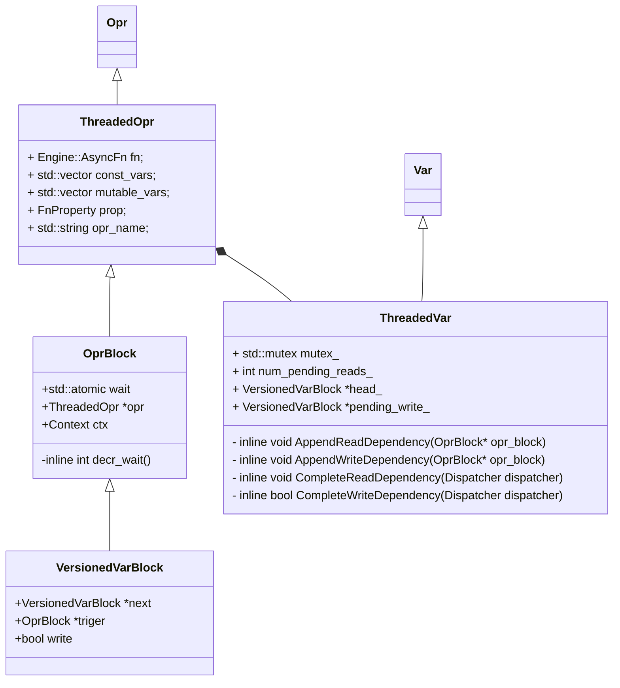

# MXNet源码分析

[toc]


## 基本结构


* Runtime Dependency Engine: Schedules and executes the operations according to their read/write dependency.

- Storage Allocator: Efficiently allocates and recycles memory blocks on host (CPU) and devices (GPUs).
- Resource Manager: Manages global resources, such as the random number generator and temporal space.
- NDArray: Dynamic, asynchronous n-dimensional arrays, which provide flexible imperative programs for MXNet.
- Symbolic Execution: Static symbolic graph executor, which provides efficient symbolic graph execution and optimization.
- Operator: Operators that define static forward and gradient calculation (backprop).
- SimpleOp: Operators that extend NDArray operators and symbolic operators in a unified fashion.
- Symbol Construction: Symbolic construction, which provides a way to construct a computation graph (net configuration).
- KVStore: Key-value store interface for efficient parameter synchronization.
- Data Loading(IO): Efficient distributed data loading and augmentation.

### Context

​	Context维护每个任务的上下文，构造的时候需要传递设备信息。包含如下四种主要类型的Context:

* cpu:  运行于普通CPU对应的RAM分配
* pinned_cpu[1] ： GPU模式下，主机分配CPU Pinned Memory[2]；
* gpu： GPU模式下，主机分配可分页；
* cpushared:  Android Shared Memory分配；

### Storage Allocator

​	Allocator是内存分配器，其提供的方法如下：


​	`storage.cc/StorageImpl` 在实现Storage接口的时候，需要首先加载对应的内存管理器(`storage_manager.h/StorageManager`)，然后由管理器实现的实际的`Alloc/Free/DirectFree`操作。

​	内存管理器根据不同设备类型，实现不同实现了7种不同的内存管理器。主要实现为：

* NaiveStorageManager
  * CPUDeviceStorage :  [地址对齐](https://man7.org/linux/man-pages/man3/posix_memalign.3.html)的内存分配. 对应Context::kCPU. 
  * GPUDeviceStorage:    调用`cudaMalloc/cudaFree`进行内存分配和释放； 对应Context::kGPU. 
  * PinnedMemoryStorage:  调用`cudaAllocHost/cudaFreeHost`进行主机锁页分配和释放； 对应Context::kCPUPinned. 
* CPUSharedStorageManager:  对应Context::kCPUShared. 
* PooledStorageManager： 使用内存池进行内存分配和管理。根据Round方式不同, 采用不同的Container索引不同状态的内存。

### Resource Manager

​	ResourceManager主要针对随机数生成器资源以及临时空间资源管理进行分配。其提供的方法如下：


默认实现是`resource::ResourceManagerImpl`。

​	Request()根据用户需要的资源类型返回对应的资源，主要资源包括：

> * kRandom :  对应mshadow::Random<xpu> object。 就是在不同设备上提供的随机数生成器的封装。
>   * CPU:  C++ [mt19937](http://www.cplusplus.com/reference/random/mt19937/)
>   * GPU: [cuRADN](https://docs.nvidia.com/cuda/curand/host-api-overview.html)
> * kTempSpace： 任意长度的动态内存分配。使用前面提到的Storage Allocator分配；
> * kParallelRandom：异步随机数分配，参考依赖引擎里面的解释。
> * kCuDNNDropoutDesc：参考 [3.1.1.3. cudnnDropoutDescriptor_t](https://docs.nvidia.com/deeplearning/cudnn/api/index.html#cudnnDropoutDescriptor_t)。提供dropout操作。

### Runtime Dependency Engine

​	[运行时依赖引擎](https://mxnet.apache.org/versions/1.6/api/architecture/note_engine)（简称RDE）主要负责计算图的全生命周期管理，目标是最大程度的实现并行计算。计算图也就是训练任务/通用计算任务的数据流图。

​	Mxnet在构建数据流通的时候，还要充分考虑内存的复用，因此，mxnet增加了一个特殊的节点: `Object::__del__`节点。当当前对象Object不在被使用的时候，就会自动插入这个del节点，对齐独占的内存进行释放。另外就是对于随机数分配，考虑到随机数分配器是线程不安全的，因此要串行化分配随机数资源。

​	有了以上约束，我们就可以开始构建依赖关系。按照正常的思路，基于数据流的依赖关系，可以借助[MVCC](https://en.wikipedia.org/wiki/Multiversion_concurrency_control)的思路，引入版本控制，对于**写**产生新的版本且标记其引用的版本，对于**读**标记其引用的版本。然后基于这些依赖关系，构建出一个**DAG**。然后对DAG进行拓扑排序，然后通过遍历叶子节点找出所有不同的根节点（逆拓扑遍历），找出**独立子图**。  独立子图之间是可以交给多个线程独立计算。**但是**, 对于机器学习任务，要支持动态计算图的话，就不能这么简单的计算全局的独立子图了。于是乎，那就mxnet就采用单线程，按照正常的拓扑序列进行计算。后面再符号执行那一块再给出优化方法。

​	针对依赖引擎的基本原理，[官网](https://mxnet.apache.org/versions/1.6/api/architecture/note_engine)给出了很生动的解释。 首先Mxnet定义了VarHandle(Engine/Var)表示变量，OprHandle(Engine/Opr)表示操作。那么依赖关系就是以Opr为点，Var为边。在实际执行的时候，OprBlock会对Opr进行封装，作为基本的执行单元。VersionedVarBlock维护VarHandle的版本信息，给同一个VarHandle的不同优先级（依赖关系作为最高优先级）的OprBlock建立一个[队列](https://mxnet.apache.org/versions/1.6/api/cpp/docs/api/classdmlc_1_1ConcurrentBlockingQueue.html)。对应的关系对象如如下：



​	其中最关键的部分是ThreadedVar，成员变量解释如下：

> * num_pending_reads\_ : 当前Var被读依赖的次数；
> * pending_write\_: 当前被写依赖的的Var， 并且执行该Var所维护的依赖操作队列的头部；_
> * head\_： 队列尾部;

​	其次是OprBlock，成员，会有一个wait成员，标记当前Var的依赖操作的个数，如果为0，那么就可以执行当前节点的操作`PushToExecute`。

​	实际处理变量的Push的时候，对于只读变量(const_vars),  在`ThreadedVar::AppendReadDependency`中如果发现该变量队列中没有等待写入的操作(`pending_write_ == nullptr`)， 那么增加`num_pending_reads_`, 并且减少wait，表示当前读依赖就绪。否则将当前const_var转换成VersionedVarBlock， 并且插入到其关联的队列后面。对于写入，直接在当前变量对应的队列的尾部(head\_)插入新的VersionedVarBlock, 如果此时发现`num_pending_reads_ == 0`,  也就是所有的读依赖都完成了, 减少wait，表示当前写依赖就绪。

​	当一个实际的读操作完成的时候，就会触发`CompleteReadDependency`方法，减少`num_pending_reads_`, 并且判断`num_pending_reads_ == 0 && pending_write_ != nullptr`的时候，触发该`pending_write_`执行。 

​	写操作完成的时候，就会相应触发`CompleteWriteDependency`，首先要递增该Var的**版本**，然后找到后继的读依赖，一一触发，直到找到一个新的写依赖，并且触发该操作。

​	示意图如下：


<center>[点击](https://raw.githubusercontent.com/dmlc/web-data/master/mxnet/engine/dep_queue.gif)查看gif</center>

​	Mxnet::Engine具体提供了3个操作建立DAG：

 * Engine::Push

   ```
   	virtual void Push(OprHandle op, Context exec_ctx, int priority = 0, bool profiling = false) = 0;
   ```

   ​	作为最后实际执行op的地方。

 * Engine::PushAsync

   ```
     virtual void PushAsync(AsyncFn exec_fun, Context exec_ctx,
                            std::vector<VarHandle> const& const_vars,
                            std::vector<VarHandle> const& mutable_vars,
                            FnProperty prop = FnProperty::kNormal,
                            int priority = 0,
                            const char* opr_name = nullptr,
                            bool wait = false) = 0;
   ```

   ​	构建OprBlock,  更新const_vars（只读）和mutable_vars（可写）的VersionedVarBlock维护的队列；

* Engine::PushSync

  ```
    virtual void PushSync(SyncFn exec_fn, Context exec_ctx,
                          std::vector<VarHandle> const& const_vars,
                          std::vector<VarHandle> const& mutable_vars,
                          FnProperty prop = FnProperty::kNormal,
                          int priority = 0,
                          const char* opr_name = nullptr) {
  
  ```

  ​	调用PushAsync, 但是wait=true.

Mxnet提供了多种执行引擎，不同的执行引擎因为功能不一样，实现的Engine的接口的功能也不一样：

* NativeEngine: 其实是个同步执行引擎。
* CreateThreadedEnginePooled：多设备共享的多线程池执行引擎; 
* CreateThreadedEnginePerDevice： 设备独立的多线程池执行引擎；

### NDArray

​	TODO.....

​	介绍NDArrary之前，先了解[numpy.ndarray](https://numpy.org/doc/stable/reference/arrays.ndarray.html)。numpy.ndarray 由一段内存连续的类型一样（dtype）的一位数组组成(data字段)， 由一个元祖(shape)表示各个维度的大小， 通过步幅(stride tuple)表示遍历该ndarry的时候各个维度上的跨度。

​	Mxnet的NDArray虽然在用法上跟numpy.ndarray很类似，但是有一些[不同点](https://mxnet.incubator.apache.org/versions/1.6/api/python/docs/api/ndarray/index.html)。最主要是对GPU的支持。NDArray依赖于mshadowd完成张量运算（Forward）, 以及梯度运算（Backward）。

#### 运算库[mshadow](https://github.com/dmlc/mshadow/tree/master/guide)

* 延迟计算： 在“=”操作符上执行真正的计算。默认将计算定向到MKL或者BLAS
* 复合模板和递归计算： 通过模板(Unary/Binary)表达式支持多种类型(scalar/vector/matrix等tensor)的运算。TBlob是一种shape可动态改变的数据结构。
* 支持在异构硬件(xpu)上计算/随机数生成等

### KVStore


### IO


### Symbolic Execution

​	实现计算图执行和优化。按照现代编译器的优化方式，所有的变量、算子都首先要转换为IR，然后在IR的基础上执行优化，最后转换成架构相关的代码。

#### NNVM

#### IR

​	IR作为中间代码，

#### 


## 其他基础库

### dmlc-core

https://dmlc-core.readthedocs.io/en/latest/parameter.html

### 


## 参考

1. https://lwn.net/Articles/600502/
2. https://blog.csdn.net/chenxiuli0810/article/details/90899014

