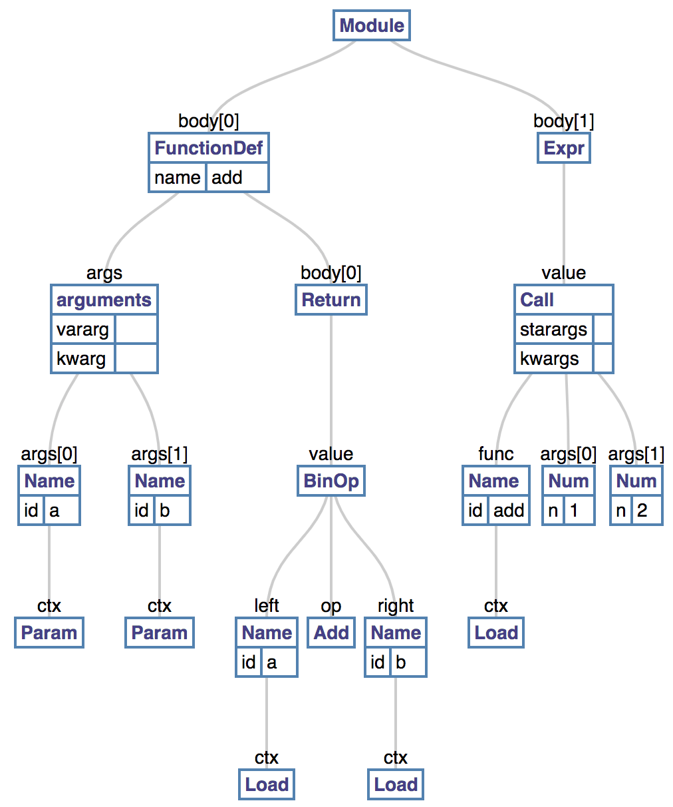

# Python Insight

[toc]

## Overview

### Python程序调试

#### pdb

​	[pdb](https://docs.python.org/3.2/library/pdb.html)是python通过库的形式提供的调试工具，只需要通过`python -m pdb demo1.py`就可以借助于交互式命令调试自己的python脚本。

​	但是如果要分析Python本身的话，或者说你遇到如下一些问题[DWG, DGPPWG]：

* python无法捕获的段错误
* 进程挂起，pdb根本无法返回trace信息
* 后台进程失控

因此这个时候就需要gdb出场。

#### gdb

​	gdb调试可以完全参考其[官方文档](https://sourceware.org/gdb/onlinedocs/gdb), 通过`gdb python`或者`gdb python -p $pid`进行。 注意编译python的时候指定`--with-pydebu`标签。

效果简单演示如下:  

```c
$ gdb python3.6
(gdb) !cat demo1.py
def add(a, b):
  return a + b;

print(add(1.0, 2))
(gdb) b main
(gdb) r demo1.py
(gdb) l
15	}
16	#else
17
18	int
19	main(int argc, char **argv)
20	{
21	    wchar_t **argv_copy;
22	    /* We need a second copy, as Python might modify the first one. */
23	    wchar_t **argv_copy2;
24	    int i, res;
(gdb) tui enable ## 效果更佳
```

### Python程序执行

​    注意接下来代码涉及到python源码的地方，都是指python3.6版本的源码。

​	一个python程序执行要经过Initialization、compilation以及execution三个阶段。

* Initialization:  完成非交互式模式下对Python进程的初始化工作,  源码在[Py_InitializeEx](https://github.com/python/cpython/blob/3.6/Python/pylifecycle.c#L468)；
* compilation：将源码编译成为代码对象的过程；编译过程从[run_file](https://github.com/python/cpython/blob/3.6/Modules/main.c#L312)开始； 
* execution：通过解释器执行代码对象的过程，从 _PyEval_EvalCodeWithName开始，`Python/ceval.c:3855`；

​	从高度抽象的层面来看，Python的执行过程如下：


<center> 图1： 编译执行过程，来自[Book IPVM] </center>

​	在分析源码的时候，可以通过doxygen生成代码文档和调用依赖信息，然后通过`python -m SimpleHTTPServer`查看代码依赖关系和文档。sss

#### 词法分析

​	词法分析的目的是将源代码转换为Parser Tree (也叫做CST, concrete syntax tree)。

​	Python parser是一个符合[LL(1)](https://en.wikipedia.org/wiki/LL_parser)文法的解析器，按照扩展巴恩斯范式(EBNF)进行定义文法。具体文法定义在Grammar/Grammar。

​	Python的token主要分为以下几种：

* identifiers： 程序里面定义的标识符，例如函数名、变量名、类名等
* operators： 操作符，
* delimiters：定界符，用于进行表达式分组，包括`(, )`, `{,}`, `=`, `*=`等
* literals： 字面量，代表常量值，例如字符串常量等
* comments： 注释
* NEWLINE： 换行符
* INDENT and DEDENT ：缩进和回退

parser的核心代码在[PyParser_ParseFileObject](https://github.com/python/cpython/blob/3.6/Parser/parsetok.c#L116). 从`run_file/PyRun_AnyFileExFlags/PyRun_SimpleFileExFlags/PyRun_FileExFlags/PyParser_ASTFromFileObject`调用而来， 返回node结构体，一个node就是一个parse tree节点，表示一个token, 定义于`Include/node.h:41`。

例如：

```
In [114]: code_str = """
     ...: def add(a, b):
     ...:   return a + b
     ...: add(1, 2)
     ...: """

In [115]: from pprint import pprint 
     ...: st = parser.suite(code_str)
     ...: pprint(parser.st2list(st))
```

可以打印出parse tree如下：

```
In [118]: pprint(parser.st2tuple(st))
(257,
 (269,
  (295,
   (263,
    (1, 'def'),
    (1, 'add'),
    (264,
     (7, '('),
     (265, (266, (1, 'a')), (12, ','), (266, (1, 'b'))),
     (8, ')')),
    (11, ':'),
    (304,
     (4, ''),
     (5, ''),
     (269,
      (270,
       (271,
        (278,
         (281,
          (1, 'return'),
          (274,
           (306,
            (310,
             (311,
              (312,
               (313,
                (316,
                 (317,
                  (318,
                   (319,
                    (320,
                     (321, (322, (323, (324, (325, (1, 'a')))))),
                     (14, '+'),
                     (321, (322, (323, (324, (325, (1, 'b')))))))))))))))))))),
       (4, ''))),
     (6, ''))))),
 (4, ''),
 (0, ''))
```

  其中每个touple的第一个元素的编号信息可以在 [graminit](https://github.com/python/cpython/blob/3.6/Include/graminit.h) 和 [token](https://github.com/python/cpython/blob/3.6/Include/token.h)找到。例如[257](https://github.com/python/cpython/blob/3.6/Include/graminit.h#L4)表示[file_input](https://docs.python.org/3.6/reference/toplevel_components.html#file-input)等, 通过[Language Reference](https://docs.python.org/3.6/reference/index.html)可以查到具体token的用法。

#### 语法分析

​	语法分析是将Parse Tree转换为AST。通过[vpyast](https://vpyast.appspot.com/)可以很方便的查看AST的结构。 例如上面的例子的AST结构如下：

​	

​	也可以借助ast库进行分析, 例如：

```
In [124]: import ast
In [125]: import pprint
In [126]: node = ast.parse(code_str, mode="exec")
In [127]: ast.dump(node)
Out[127]: "Module(body=[FunctionDef(name='add', args=arguments(posonlyargs=[], args=[arg(arg='a', annotation=None, type_comment=None), arg(arg='b', annotation=None, type_comment=None)], vararg=None, kwonlyargs=[], kw_defaults=[], kwarg=None, defaults=[]), body=[Return(value=BinOp(left=Name(id='a', ctx=Load()), op=Add(), right=Name(id='b', ctx=Load())))], decorator_list=[], returns=None, type_comment=None)], type_ignores=[])"
```

​	AST的解析是从[PyAST_FromNodeObject](https://github.com/python/cpython/blob/3.6/Python/ast.c#L769)开始的， 传入parser tree的根节点，遍历Parse Tree，按照语法规则[Language Reference](https://docs.python.org/3.6/reference/index.html)表示的syntax diagram，转成AST格式，传出一个_mod(`Include/Python-ast.h:44`)对象。也就是上图的Module。

​	转换成AST之后，源码由`run_mod`函数开始进行Module的编译执行。核心逻辑在`PyAST_CompileObject` (Python/compile.c:301)完成，返回`PyCodeObject`。 在这个过程，首先要进行语义分析，然后建立对应的符号表。

##### 语义分析(semantic analysis)

​	语义分析就是要分析statement的含义的过程，分析语义自然要涉及到每个stmt所在上下文以及对应的symbol的lifecyle管理。在Python里面， 所有的元素都是[对象](https://docs.python.org/3.6/c-api/structures.html#c.PyObject)。  对于c/c++这类语言，一个变量的类型是跟变量名字[绑定](https://docs.python.org/3.6/reference/executionmodel.html#naming-and-binding)的，但是在Python里面类型是跟对象绑定的。同时对象也具备自己的属性和方法。 del关键字则可以实现解绑。

```
x = 5  # 将x绑定到5对应的对象上；
print(type(x));
x = "hello" #将x绑定到字符串"hello"对应的对象上；
print(type(x))
```

输出如下：

```
<class 'int'>
<class 'str'>
```

​	在进一步介绍之前，需要先了解下Python程序的结构。基本结构如下：

```mermaid
classDiagram
      CodeBlock <|-- Module
      CodeBlock <|-- Class
      CodeBlock <|-- Function
      CodeBlock: execution unit
      
      class Module{
      		+ namespace: global,builtin
          + Class
          + Function()
      }
      class Class{
          + namespace: local,builtin
          + fields
          - method()
      }
      class Function{
      		+ namespace: local,builtin
          + signature
          + body()
      }
      
      Function <|-- BasicBlock
      class BasicBlock {
      	+ [instruction]
      	+ BasicBlock
      }
      
      class global {
      	+ map
      }
      class local {
      	+ map: 
      }
      class builtin {
      	+ map: builtin functions
      }
      
      class namespace {
      	+ map
      }
      namespace <|-- builtin
      namespace <|-- local
      namespace <|-- global
      
      class instruction {
      	 + i_opcode
      	 + i_oparg
      }
      
      BasicBlock <|-- instruction
```

<center>图1：程序组成 </center>

​	程序中的对象的scopes是该对象按照namespace的访问规则能够看到的对象视图。 大家可能对lamdba会有疑问，本质上lamda就是一个局部匿名结构体，结构体包含了其本身可见的对象作为其成员变量，然后重载`()`成为一个[callable](https://docs.python.org/3.6/library/functions.html?highlight=callable#callable)对象。

​	那么有了以上信息的时候，我们就可以构建符号表， 以便于进一步生成字节码，进行执行。

##### 符号表

​	符号表的左右就是要将图1中的各种对象的关系描述清楚。Python的符号表结构见[symtable](https://github.com/python/cpython/blob/3.6/Include/symtable.h#L18), 也可以参考[python-internals-symbol-tables](https://eli.thegreenplace.net/2010/09/20/python-internals-symbol-tables-part-2/)了解每个字段的含义. 我们可以借助于[symtable](https://docs.python.org/3.6/library/symtable.html?#module-symtable)显示我们分析的Parse Tree生成的符号表信息。

​	我们先定义一个符号表打印函数：

```
def describe_symtable(st, recursive=True, indent=0):
    def print_d(s, *args):
        prefix = ' ' * indent
        print(prefix + s, *args)

    assert isinstance(st, symtable.SymbolTable)
    print_d('Symtable: type=%s, id=%s, name=%s' % (
                st.get_type(), st.get_id(), st.get_name()))
    print_d('  nested:', st.is_nested())
    print_d('  has children:', st.has_children())
    print_d('  identifiers:', list(st.get_identifiers()))

    if recursive:
        for child_st in st.get_children():
            describe_symtable(child_st, recursive, indent + 5)
```

然后打印下之前定义的代码串的符号表：

```
In [174]: code_str = """
     ...: class Math(object):
     ...:   def __init__(a: int):
     ...:     self.base = a;
     ...:   def add(self, b):
     ...:     return self.base + b;
     ...: m = Math(10);
     ...: print(m.add(100));
     ...: """
In [179]: st = symtable.symtable(code_str, "<string>", "exec")

In [180]: describe_symtable(st)
Symtable: type=module, id=140641729334304, name=top
  nested: False
  has children: True
  identifiers: ['Math', 'object', 'm', 'print']
     Symtable: type=class, id=140641729333480, name=Math
       nested: False
       has children: True
       identifiers: ['__init__', 'int', 'add']
          Symtable: type=function, id=140641729332896, name=__init__
            nested: False
            has children: False
            identifiers: ['a', 'self']
          Symtable: type=function, id=140641729333408, name=add
            nested: False
            has children: False
            identifiers: ['self', 'b']
```

可以看到，这种嵌套结构跟之前图1的定义非常的类似。符号表基本上将所有的对象的lifecycle以及对象之间的关系建立起来了，有了这些信息之后，就可以基于他们进行执行优化了，优化相关的细节可以参考龙书或者llvm相关的介绍。


​	//TODO 补充源码相关的信息

#### 字节码

​	字节码可以理解为一种已经经过优化了的中间代码，但是不能直接执行，需要借助于虚拟机/解释器进行执行。

#### 解释器

## 参考

[Book IPVM] :  https://leanpub.com/insidethepythonvirtualmachine

[DWG] : https://wiki.python.org/moin/DebuggingWithGdb

[DGPPWG] : Debugging Hung Python Processes With GDB  https://pycon.org.il/2016/static/sessions/john-schwarz.pdf

[PTC] : Python Type Checking (Guide)   https://realpython.com/python-type-checking


