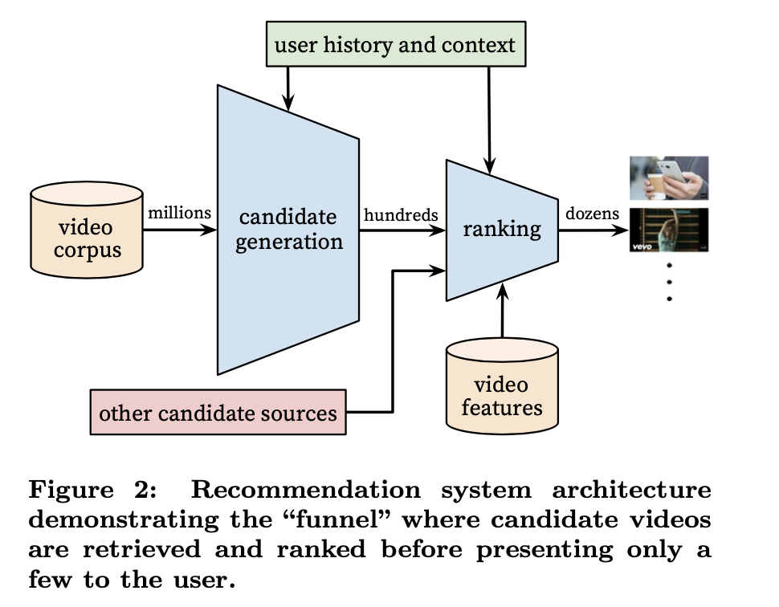
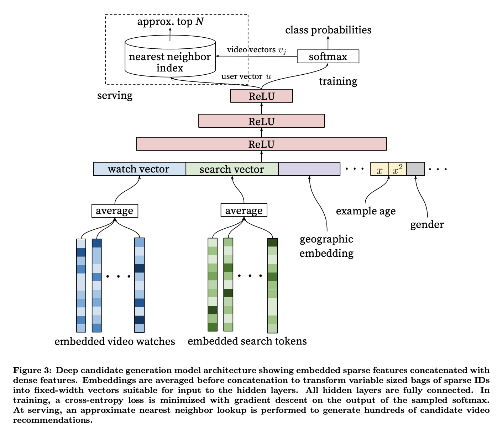
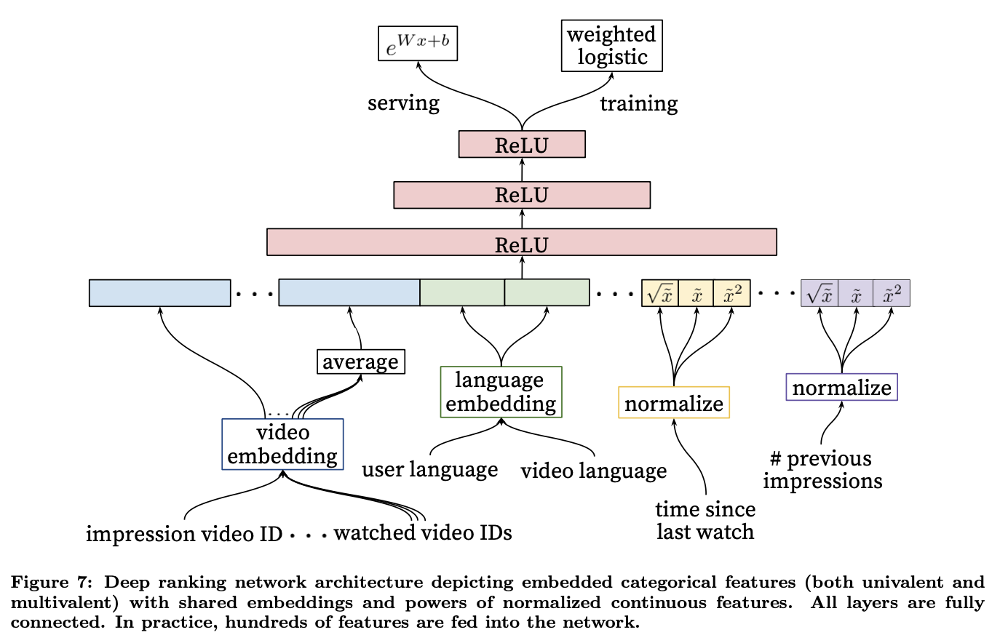
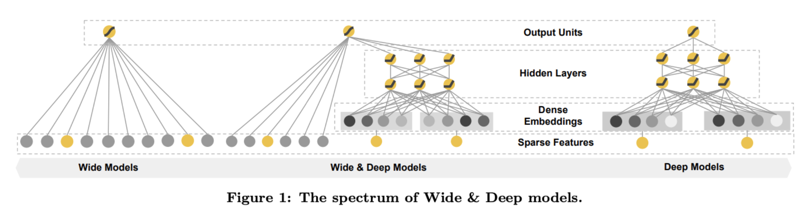
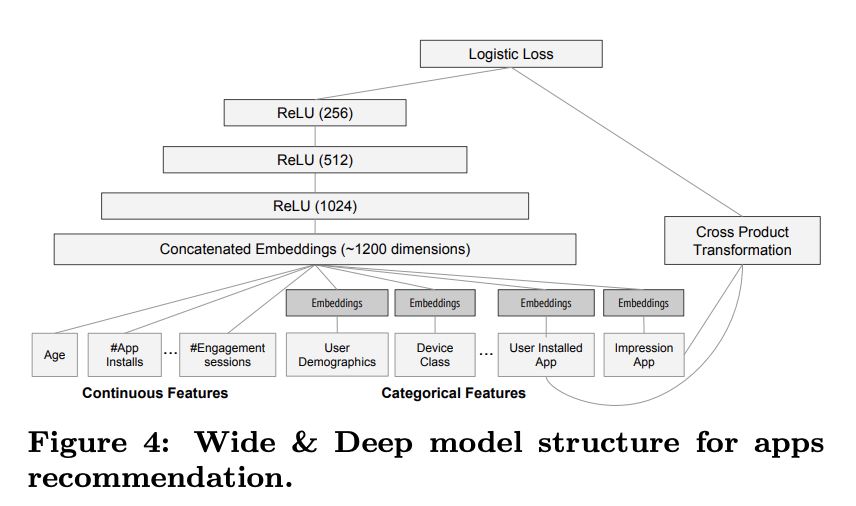
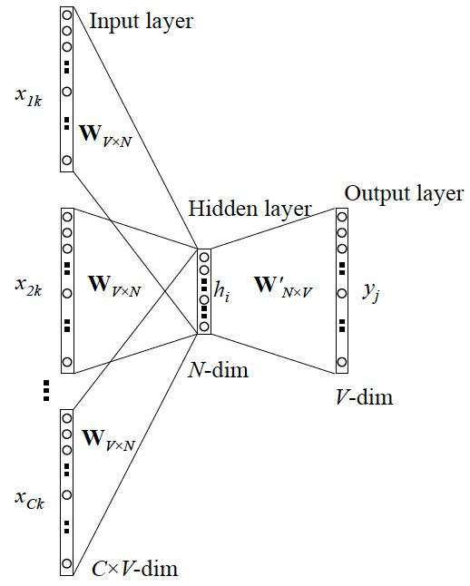

# 论文

Bing Duan, 2020.9

[toc]

# 推荐系统

**问题描述**

f(user, item, context) ->  item list， f表示推荐算法

**推荐算法演进**

- 协同过滤： 可解释性强

  相似度计算： 

  	* $sim(i, j) = cos(i, j) = \frac{i \cdot j}{\| i\|\cdot\|j\|}$
  	* [皮尔逊相关系数]([https://zh.wikipedia.org/wiki/%E7%9A%AE%E5%B0%94%E9%80%8A%E7%A7%AF%E7%9F%A9%E7%9B%B8%E5%85%B3%E7%B3%BB%E6%95%B0](https://zh.wikipedia.org/wiki/皮尔逊积矩相关系数))corr(X, Y)

- 矩阵分解： 增强泛化
  $$
  R = UV, U = [p_1,..., p_n]^T, V = [q_1,...q_k] \\
  \hat r_{ui} = q_i^Tp_u
  $$
  $\hat r_{ui}$表示用户u对物品i的喜好程度得分。R为Co-occurrence Matrix， U和V分别是user & item matrix。

- LR：  引入上下文、用户和物品等多种特征融合
  $$
  f(x)= \frac{1}{1 + e ^ {-(wx + b)}}
  $$

- POLY2/FM/FFM:  [辛普森悖论](https://zh.wikipedia.org/wiki/辛普森悖论)，多特征交叉， FFM引入特征域（包含相同性质的特征），进一步增强模型的表达能力；
  $$
  POLY2(W,X) = \sum\limits_{j_1 = 1}^n\sum \limits_{j_2 = j_1 + 1}^n w_h(j_1,j_2)x_{j_1}x_{j_2}  \\
  FM(W,X) = \sum\limits_{j_1 = 1}^n\sum \limits_{j_2 = j_1 + 1}^n (w_{j_1} \cdot w_{j_2})x_{j_1}x_{j_2}  \\
  FFM(W,X) = \sum\limits_{j_1 = 1}^n\sum \limits_{j_2 = j_1 + 1}^n (w_{j_1,f_2} \cdot w_{j_2,f_1 })x_{j_1}x_{j_2}  \\
  $$

- 深度学习推荐模型

- - NeuralCF: 用神经网络代替矩阵分解中的点积操作；
  - Deep & Wide @youtube： "泛化能力"和"记忆能力"的结合；
  - FNN/DeepFM/NFM:  将特征交叉操作引入到MLP中；
  - DIN/DIEN @alibaba: 在Embedding层和MLP层加入[Attention机制](https://zhuanlan.zhihu.com/p/51623339)

## Deep Neural Networks for YouTube Recommendations 

​	本文提出了一种典型的推荐系统架构，将召回看做多分类问题， 利用深度学习对用户和视频做enbedding，然后通过计算用户和视频embedding之间的得分，排序阶段再次利用深度学习，结合多种特征进行精排。是工程实现的典范。

### 目标

1. Scale: Highly specialized distributed learning algorithms and efficient serving systems
2. Freshness： balancing new contents with well-formed videos 
3. Noise: robust to particular characteristics of training data

### Overview

​	2层神经网络，第一层产生候选（粗排），一层用来生成排序（精排）。 

### 候选生成

#### 问题建模

生成阶段转换为多分类(**Efficient Extreme Multiclass**)问题。即在时刻t，为用户U（上下文信息C）在视频库V中精准的预测出视频i的类别（每个具体的视频视为一个类别，i即为一个类别）。
$$
P(w_t = i | U, C) = \frac{e^{v_i u}}{\sum\limits_{j\in V} e^{v_j u}}
$$
​	该模型需要利用embedding来表示用户历史和视频信息，难点在于如何高效的处理海量的**分类**，参考了word2vec有2种方案： 1） [negative sampling](https://www.cnblogs.com/pinard/p/7249903.html)； 2） [hierarchical softmax](https://www.cnblogs.com/pinard/p/7243513.html)。 论文采用了方案1）是因为考虑到2）方案要求类别簇节点之间是无关的，很难在推荐场景试用，同时方案1）实现更简单。

#### 模型架构

​	模型采用(watch video, search tokens, geographic enbedding, example age, gender, ...) 等多种维度特征进行forward反馈获得user embedding。 对于计算candidate videos，训练阶段试用negtive sampling替换softmax来加速，serving阶段使用softmax来获得video enbedding跟user embedding计算点积，选择topK作为最终推荐的视频。		

​	example age没有明确定义，简单理解为视频上传之后曝光的时间。gender等属于用户个体特征。

​	文中还提到了一些label和context选择的技巧。特别是asymmetric co-watch， 采用序列式的方式预测next watch，效果比传统的协同过滤更好。

### RANKING

​	由于经过候选生成阶段的筛选，视频候选只有几百量级，所以候选排序阶段可以引入更多特征进行精细的打分排序。

排序阶段采用和候选生成阶段类似的网络结构，用logistics regresion对视频进行打分。不同的是，排序阶段采用观看时长作为学习目标而非点击率，因为点击率会有很多诱导点击的标题党内容，用户点击后很快会停止观看，所以观看时长是一个更合适表示用户是否感兴趣的指标。	

#### 模型

​		可以看到，ranking阶段 training的最后一层是[weighted LR](https://www.cnblogs.com/hellojamest/p/11871108.html), 来体现期望时长在排序中影响(对数几率odds)， serving用的激活函数是exp, 其次是特征工程跟候选阶段不一样。

#### 特征工程

​	图7中， 从左至右的特征依次是：

1. **impression video ID embedding**: 当前要计算的video的embedding;

2. **watched video IDs average embedding**: 用户观看过的最后N个视频embedding的average pooling；

3. **language embedding**: 用户语言的embedding和当前视频语言的embedding；

4. **time since last watch**: 自上次观看同channel视频的时间， 类似[“attention”](http://speech.ee.ntu.edu.tw/~tlkagk/courses_MLSD15_2.html), 根据注意力范围生成下一个video的权重；

5. **#previous impressions**: 该视频已经被曝光给该用户的次数, 上一次推荐后，用户没有点击，那么下一次就应该更换；

​	从这篇论文基本了解了一个典型的基于深度学习的推荐系统架构。

## Wide & Deep Learning for Recommender Systems

​	Google在2016年提出的一个深度学习模型，应用于Google Play应用商店上的APP推荐，该模型经过在线AB测试获得了比较好的效果。

### 目标

​	将推荐系统看做query = user + context的检索系统，输出是物品推荐列表。考虑到当前线性模型(wide model)虽然简单，具备"记忆"能力，但是需要大量的人工特征工作，所以考虑将深度学习(Deep mode)跟线性模型结合，兼顾"记忆"和"泛华"能力。

### 网络模型

​	

	#### Wide操作

​	对于$y = W^T x + b$,  $x$ 主要包含2类特征： 1) 原始输入特征； 2） 通过交叉积（cross-product）变换后的特征，变换定义如下：
$$
\theta_k(x) = \prod\limits_{i=1}^{d}x_i^{c_{ki}}\ \ \ c_{ki} \in {0, 1}
$$
​		也就是当第k次转换所包含的成分特征$x_i$为1的时候（例如二元特征AND (gender = female, language=en), 必须2个条件都满足），交叉积才为1， $\theta_k(x)$为所有成分特征的乘积。

#### Deep操作

​	Deep部分是一个MLP。每个一个隐藏层的转换为： $\alpha^{(l+1)} = f(W_{deep}^{(l)}\alpha^{(l)} + b^{(l)})$, $l$代表层数。f(*)是激活函数， 一般是ReLU。$W, b$是要训练的参数。

#### Wide & Deep联合训练

​	如上图，训练过程将数值特征、类别特征等通过embedding处理，构成一个大概约1200维的向量灌入Deep模型，Wide模型则是使用APP安装和APP评分(impression)两类特征通过交叉积变换形成模型需要的特征。最后通过反向传播算法来训练该模型(wide模型采用FTRL优化器，deep模型采用AdaGrad优化器)，并上线到APP推荐业务中做AB测试。

#### Model Serving

​	基于用户特征和候选app信息，在Wide&Deep网络上运行前向计算，在预测部分，例如对于逻辑回归问题，采用如下模型进行计算：
$$
P(Y = 1 | x) = \sigma(w_{wide}^T[x, \theta(x)] + w_{deep}^T\alpha^{(l_f)} + b)
$$
​	Y是二元分类标签，$\sigma( * )$表示sigmoid函数，$\theta(x)$是原始特征的交叉积，$w_{wide}$是wide模型权重参数。

## 参考

[PJE] Paul Covington, Jay Adams, Emre Sargin Google,  [Deep Neural Networks for YouTube Recommendations](https://static.googleusercontent.com/media/research.google.com/zh-CN//pubs/archive/45530.pdf) ,  https://zhuanlan.zhihu.com/p/52169807

[HLJ+] Heng-Tze Cheng, Levent Koc, Jeremiah Harmsen, et.al Wide & Deep Learning for Recommender Systems

# NLP

## Word2Vec

问题： $y = f(x)$.  x是词语，y是上下文词语， f是language model. 判断(x, y)是否是符合自然语言的规则。

f一般有2种：

* skip-gram:  x是给定的词向量，y是上下文最可能出现的词向量, 网络结构如下：

  

  ​	其中隐藏层的激活函数是线性的，输入x是每个词的 one-hot编码，输出是一个降维之后的词向量（embedding）。输出层是softmax。

* CBOW:  跟skip-gram相反，x是上下文的词向量，y是预测这个词。网络结构如下：

  

  ​	

  优化手段：

  * 隐藏层采用词向量求和然后取平均；
  * 霍夫曼树
  * hierarchical softmax
  * negative sampling

## BERT

