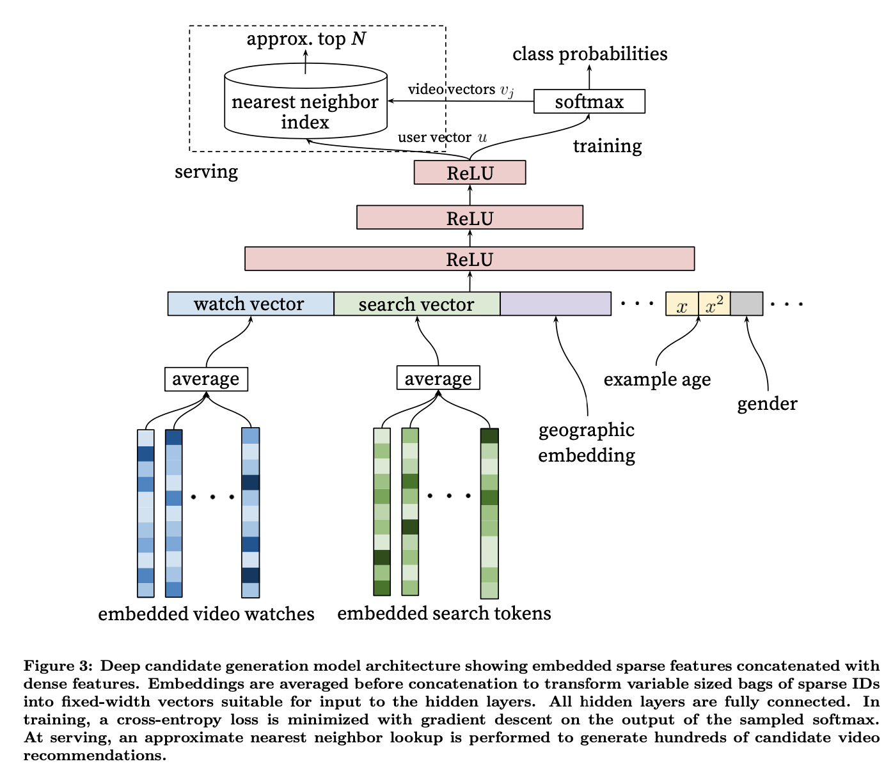

# Youtube推荐系统论文

​	论文[pje]是工程界关于深度学习推荐系统比较典型的论文。

### 目标

1. Scale: Highly specialized distributed learning algorithms and efficient serving systems
2. Freshness： balancing new contents with well-formed videos 
3. Noise: robust to particular characteristics of training data

### Overview

​	2层神经网络，第一层产生候选（粗排），一层用来生成排序（精排）。 

### 候选生成

#### 问题建模

生成阶段转换为多分类(**Efficient Extreme Multiclass**)问题。即在时刻t，为用户U（上下文信息C）在视频库V中精准的预测出视频i的类别（每个具体的视频视为一个类别，i即为一个类别）。
$$
P(w_t = i | U, C) = \frac{e^{v_i u}}{\sum\limits_{j\in V} e^{v_j u}}
$$
​	该模型需要利用embedding来表示用户历史和视频信息，难点在于如何高效的处理海量的**分类**，参考了word2vec有2种方案： 1） [negative sampling](https://www.cnblogs.com/pinard/p/7249903.html)； 2） [hierarchical softmax](https://www.cnblogs.com/pinard/p/7243513.html)。 论文采用了方案1）是因为考虑到2）方案要求类别簇节点之间是无关的，很难在推荐场景试用，同时方案1）实现更简单。

#### 模型架构

​	模型采用(watch video, search tokens, geographic enbedding, example age, gender, ...) 等多种维度特征进行forward反馈获得user embedding。 对于计算candidate videos，训练阶段试用negtive sampling替换softmax来加速，serving阶段使用softmax来获得video enbedding跟user embedding计算点积，选择topK作为最终推荐的视频。		

​	example age没有明确定义，简单理解为视频上传之后曝光的时间。gender等属于用户个体特征。

​	文中还提到了一些label和context选择的技巧。特别是asymmetric co-watch， 采用序列式的方式预测next watch，效果比传统的协同过滤更好。

### RANKING

​	由于经过候选生成阶段的筛选，视频候选只有几百量级，所以候选排序阶段可以引入更多特征进行精细的打分排序。

排序阶段采用和候选生成阶段类似的网络结构，用logistics regresion对视频进行打分。不同的是，排序阶段采用观看时长作为学习目标而非点击率，因为点击率会有很多诱导点击的标题党内容，用户点击后很快会停止观看，所以观看时长是一个更合适表示用户是否感兴趣的指标。	

#### 模型

​		可以看到，ranking阶段 training的最后一层是[weighted LR](https://www.cnblogs.com/hellojamest/p/11871108.html), 来体现期望时长在排序中影响(对数几率odds)， serving用的激活函数是exp, 其次是特征工程跟候选阶段不一样。

#### 特征工程

​	图7中， 从左至右的特征依次是：

1. **impression video ID embedding**: 当前要计算的video的embedding;

2. **watched video IDs average embedding**: 用户观看过的最后N个视频embedding的average pooling；

3. **language embedding**: 用户语言的embedding和当前视频语言的embedding；

4. **time since last watch**: 自上次观看同channel视频的时间， 类似[“attention”](http://speech.ee.ntu.edu.tw/~tlkagk/courses_MLSD15_2.html), 根据注意力范围生成下一个video的权重；

5. **#previous impressions**: 该视频已经被曝光给该用户的次数, 上一次推荐后，用户没有点击，那么下一次就应该更换；

   

​	从这篇论文基本了解了一个典型的基于深度学习的推荐系统架构。

## 参考

[PJE] Paul Covington, Jay Adams, Emre Sargin Google,  [Deep Neural Networks for YouTube Recommendations](https://static.googleusercontent.com/media/research.google.com/zh-CN//pubs/archive/45530.pdf) ,  https://zhuanlan.zhihu.com/p/52169807